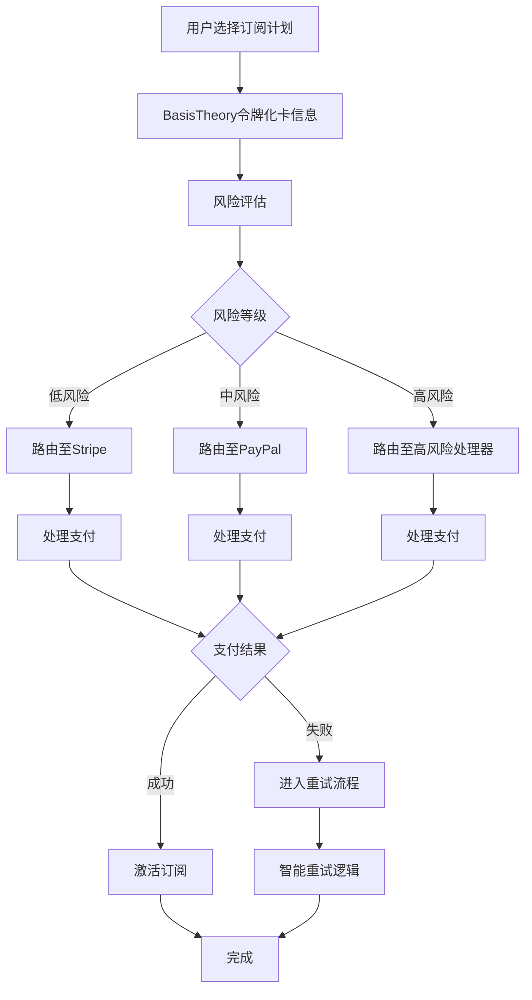

# BasisTheory 支付路由接入需求文档

**文档版本**: 1.0  
**更新日期**: 2025年1月  
**项目名称**: CrushOn.AI 支付系统优化  
**目标**: 通过接入BasisTheory支付编排平台，提升支付成功率至60%以上，简化用户支付流程

## 一、项目背景与目标

### 1.1 现状分析
- **当前支付成功率**: 35-45%（远低于行业平均水平60-70%）
- **主要问题**:
  - 高风险商户分类导致银行自动拒绝率高
  - 多支付渠道管理复杂，缺乏智能路由
  - 支付失败后缺乏有效的重试机制
  - 用户支付体验差，流失率高达30-40%

### 1.2 项目目标
- **核心目标**: 支付成功率提升至60%以上
- **关键指标**:
  - 首次支付成功率: 从25-35%提升至45-55%
  - 续费成功率: 从45-55%提升至65-75%
  - 支付转化时间: 缩短至30秒内
  - 支付失败用户留存: 提升20%

## 二、BasisTheory 集成架构

### 2.1 整体架构设计

```
┌─────────────────┐
│   用户端(Web)    │
└────────┬────────┘
         │
         ▼
┌─────────────────┐
│  CrushOn主站API  │
└────────┬────────┘
         │
         ▼
┌─────────────────────────────────────┐
│        BasisTheory Proxy             │
│  ┌─────────────────────────────┐    │
│  │    智能路由引擎              │    │
│  │  • 风险评估                 │    │
│  │  • 渠道选择                 │    │
│  │  • 令牌化处理               │    │
│  └─────────────────────────────┘    │
└──────────┬──────────────────────────┘
           │
           ▼
┌──────────┴──────────┬──────────┬──────────┬──────────┐
│       Stripe        │  PayPal   │  CCBill  │  Segpay  │
│    (低风险交易)      │ (全球覆盖) │(高风险专用)│(高风险专用)│
└────────────────────┴──────────┴──────────┴──────────┘
```

### 2.2 核心组件

#### 2.2.1 BasisTheory Proxy层
- **功能**: 统一支付接口，管理所有支付渠道
- **职责**:
  - 敏感数据令牌化（PCI DSS合规）
  - 智能路由决策
  - 支付状态追踪
  - 统一错误处理

#### 2.2.2 智能路由引擎
- **功能**: 基于多维度因素选择最优支付通道
- **决策因素**:
  - 用户地理位置
  - 支付金额
  - 历史成功率
  - 渠道实时状态
  - 用户风险评分

## 三、主站支付流程设计

### 3.1 优化后的支付流程



### 3.2 详细流程步骤

#### Step 1: 支付初始化
```json
{
  "action": "payment_init",
  "data": {
    "user_id": "usr_xxx",
    "plan_id": "premium_monthly",
    "amount": 14.99,
    "currency": "USD",
    "metadata": {
      "ip_address": "xxx.xxx.xxx.xxx",
      "device_fingerprint": "xxx",
      "session_id": "xxx"
    }
  }
}
```

#### Step 2: 令牌化处理
- 通过BasisTheory JS SDK在前端直接令牌化敏感数据
- 后端只接收令牌，不处理原始卡号
- 降低PCI合规要求

#### Step 3: 风险评估
```json
{
  "risk_factors": {
    "user_history": "new_user|returning|vip",
    "location_risk": "low|medium|high",
    "amount_risk": "normal|suspicious",
    "velocity_check": "pass|fail",
    "device_trust": 0.0-1.0
  },
  "risk_score": 0-100,
  "recommended_gateway": "stripe|paypal|ccbill|segpay"
}
```

#### Step 4: 支付执行
- 调用BasisTheory Reactor执行支付
- 实时监控支付状态
- 记录详细日志用于分析

## 四、支付渠道切换逻辑

### 4.1 智能路由规则

#### 4.1.1 基础路由规则

| 条件 | 首选渠道 | 备选渠道 | 说明 |
|------|---------|---------|------|
| 风险分 < 30 | Stripe | PayPal | 低风险优先主流渠道 |
| 风险分 30-60 | PayPal | Segpay | 中风险使用容忍度高的渠道 |
| 风险分 > 60 | CCBill | Segpay | 高风险使用专业处理器 |
| 欧洲用户 | Verotel | PayPal | 地区优化 |
| 加密支付 | Coinbase | BitPay | 加密货币专用 |

#### 4.1.2 动态切换触发条件

```javascript
const switchingRules = {
  // 成功率阈值切换
  successRateThreshold: {
    trigger: "current_success_rate < 40%",
    action: "switch_to_next_gateway"
  },
  
  // 连续失败切换
  consecutiveFailures: {
    trigger: "consecutive_failures >= 3",
    action: "switch_gateway_immediately"
  },
  
  // 超时切换
  timeout: {
    trigger: "response_time > 10s",
    action: "failover_to_backup"
  },
  
  // 金额优化
  amountOptimization: {
    trigger: "amount > 30",
    action: "prefer_high_risk_processor"
  }
}
```

### 4.2 渠道健康监控

#### 4.2.1 实时监控指标
- **成功率**: 15分钟滑动窗口
- **响应时间**: p50, p95, p99
- **错误类型分布**: 硬拒绝 vs 软拒绝
- **可用性**: 健康检查状态

#### 4.2.2 自动降级机制
```json
{
  "gateway_health": {
    "stripe": {
      "status": "healthy",
      "success_rate": 0.45,
      "avg_response_time": 1.2,
      "weight": 0.4
    },
    "ccbill": {
      "status": "degraded",
      "success_rate": 0.65,
      "avg_response_time": 2.1,
      "weight": 0.6
    }
  }
}
```

## 五、失败重试机制

### 5.1 智能重试策略

#### 5.1.1 重试决策树

```
支付失败
    │
    ├─ 硬拒绝(卡号无效/余额不足)
    │   └─ 不重试，提示用户更换支付方式
    │
    ├─ 软拒绝(风控/限额)
    │   ├─ 立即重试: 更换MCC代码
    │   ├─ 延迟重试: 3秒后使用备用渠道
    │   └─ 降额重试: 拆分金额重试
    │
    └─ 技术故障(超时/网络)
        ├─ 指数退避重试: 1s, 2s, 4s
        └─ 切换渠道重试
```

#### 5.1.2 重试配置

```javascript
const retryConfig = {
  maxAttempts: 3,
  strategies: [
    {
      errorType: "insufficient_funds",
      action: "no_retry",
      userMessage: "支付失败，请检查账户余额"
    },
    {
      errorType: "risk_declined",
      action: "retry_with_different_mcc",
      delay: 0,
      mccCodes: ["5734", "5815", "7372"]  // 软件/数字商品/服务
    },
    {
      errorType: "gateway_timeout",
      action: "exponential_backoff",
      delays: [1000, 2000, 4000],
      switchGateway: true
    },
    {
      errorType: "amount_limit_exceeded",
      action: "split_payment",
      splitStrategy: {
        parts: 2,
        firstAmount: 9.99,
        description: "CRUSHON-SUBSCRIPTION-PART"
      }
    }
  ]
}
```

### 5.2 用户体验优化

#### 5.2.1 重试过程中的UI状态

```javascript
const retryUIStates = {
  initial: {
    message: "正在处理支付...",
    showLoader: true
  },
  retrying: {
    message: "正在尝试其他支付方式...",
    showLoader: true,
    showProgress: true  // 显示重试进度
  },
  finalAttempt: {
    message: "最后一次尝试...",
    showLoader: true,
    showAlternatives: true  // 显示替代支付方式
  }
}
```

#### 5.2.2 智能失败提示

根据失败原因提供个性化解决方案：

```javascript
const failureGuidance = {
  "card_declined": {
    primary: "您的银行拒绝了此次交易",
    suggestions: [
      "联系银行解除限制",
      "尝试其他支付方式",
      "使用PayPal或加密货币"
    ],
    alternativeActions: ["switch_to_paypal", "show_crypto_option"]
  },
  "risk_threshold": {
    primary: "交易被标记为风险交易",
    suggestions: [
      "验证您的账户信息",
      "尝试较小金额",
      "使用已验证的PayPal账户"
    ]
  }
}
```

## 六、异常处理方案

### 6.1 异常分类与处理

#### 6.1.1 支付异常分类

| 异常类型 | 处理策略 | 用户提示 | 后续动作 |
|---------|---------|---------|---------|
| **网络异常** | 自动重试3次 | "网络连接中断，正在重试..." | 记录日志，切换CDN |
| **支付超时** | 查询支付状态 | "支付处理中，请稍候..." | 异步查询，邮件通知 |
| **重复支付** | 自动退款 | "检测到重复支付，将自动退款" | 24小时内退款 |
| **部分成功** | 补充支付 | "支付部分成功，需要补充支付" | 保存状态，引导补充 |
| **Webhook失败** | 重试+手动同步 | - | 指数退避重试，人工介入 |

#### 6.1.2 异常恢复流程

```python
async def handle_payment_exception(exception_type, payment_id, context):
    """统一异常处理流程"""
    
    # 1. 记录异常
    log_exception(exception_type, payment_id, context)
    
    # 2. 尝试自动恢复
    if exception_type in AUTO_RECOVERABLE:
        recovery_result = await auto_recover(exception_type, payment_id)
        if recovery_result.success:
            return recovery_result
    
    # 3. 保存支付状态
    await save_payment_state(payment_id, "EXCEPTION", context)
    
    # 4. 触发人工处理流程
    if exception_type in CRITICAL_EXCEPTIONS:
        await notify_support_team(payment_id, exception_type)
    
    # 5. 用户通知
    await notify_user(payment_id, get_user_friendly_message(exception_type))
    
    return {
        "status": "exception_handled",
        "recovery_available": True,
        "next_steps": get_recovery_steps(exception_type)
    }
```

### 6.2 数据一致性保障

#### 6.2.1 事务处理

```sql
-- 支付事务确保数据一致性
BEGIN TRANSACTION;
    -- 1. 创建支付记录
    INSERT INTO payments (id, user_id, amount, status) 
    VALUES (@payment_id, @user_id, @amount, 'PENDING');
    
    -- 2. 锁定用户订阅状态
    SELECT * FROM subscriptions 
    WHERE user_id = @user_id FOR UPDATE;
    
    -- 3. 更新支付状态
    UPDATE payments 
    SET status = @status, 
        gateway = @gateway,
        gateway_response = @response
    WHERE id = @payment_id;
    
    -- 4. 更新订阅状态
    IF @status = 'SUCCESS' THEN
        UPDATE subscriptions 
        SET status = 'ACTIVE',
            expires_at = DATE_ADD(NOW(), INTERVAL 1 MONTH)
        WHERE user_id = @user_id;
    END IF;
COMMIT;
```

#### 6.2.2 幂等性设计

```javascript
const idempotencyKey = {
  generate: (userId, planId, timestamp) => {
    return crypto
      .createHash('sha256')
      .update(`${userId}-${planId}-${timestamp}`)
      .digest('hex');
  },
  
  check: async (key) => {
    const exists = await redis.get(`idempotency:${key}`);
    if (exists) {
      return JSON.parse(exists);  // 返回已有结果
    }
    return null;
  },
  
  save: async (key, result, ttl = 86400) => {
    await redis.setex(
      `idempotency:${key}`,
      ttl,
      JSON.stringify(result)
    );
  }
};
```

## 七、监控与告警

### 7.1 关键指标监控

#### 7.1.1 业务指标

```yaml
business_metrics:
  - name: payment_success_rate
    formula: successful_payments / total_payments
    threshold: 
      warning: < 50%
      critical: < 40%
    window: 15m
    
  - name: average_payment_time
    formula: avg(payment_completion_time)
    threshold:
      warning: > 5s
      critical: > 10s
      
  - name: retry_effectiveness
    formula: retry_successes / total_retries
    threshold:
      warning: < 30%
      critical: < 20%
```

#### 7.1.2 技术指标

```yaml
technical_metrics:
  - name: gateway_availability
    check: health_check_endpoint
    interval: 30s
    
  - name: api_response_time
    percentiles: [p50, p95, p99]
    threshold:
      p95: > 2s
      p99: > 5s
      
  - name: error_rate
    formula: errors / total_requests
    threshold:
      warning: > 1%
      critical: > 5%
```

### 7.2 告警配置

```javascript
const alertRules = {
  // 支付成功率告警
  paymentSuccessRate: {
    condition: "rate < 40% for 5 minutes",
    severity: "critical",
    channels: ["pagerduty", "slack", "email"],
    escalation: {
      after: "10 minutes",
      to: "engineering_lead"
    }
  },
  
  // 渠道故障告警
  gatewayFailure: {
    condition: "gateway_down for 2 checks",
    severity: "high",
    channels: ["slack", "ops_team"],
    autoResponse: "switch_to_backup_gateway"
  },
  
  // 异常交易告警
  fraudDetection: {
    condition: "fraud_score > 90",
    severity: "medium",
    channels: ["security_team"],
    action: "block_transaction"
  }
};
```

## 八、安全与合规

### 8.1 PCI DSS合规

#### 8.1.1 数据安全要求
- **不存储敏感数据**: 使用BasisTheory令牌化，主站不存储卡号
- **传输加密**: 全程TLS 1.3加密
- **访问控制**: 基于角色的访问控制(RBAC)
- **审计日志**: 所有支付操作记录详细日志

#### 8.1.2 安全架构

```
前端收集 → BasisTheory令牌化 → 后端处理令牌 → 支付网关
    ↓             ↓                    ↓              ↓
  HTTPS      Tokenization          No PAN       Secure API
```

### 8.2 反欺诈措施

```javascript
const fraudDetection = {
  velocityChecks: {
    // 频率检查
    maxAttemptsPerHour: 5,
    maxAmountPerDay: 500,
    maxCardsPerUser: 3
  },
  
  riskSignals: {
    // 风险信号
    newUser: +10,
    vpnDetected: +20,
    mismatchedGeoIP: +15,
    highRiskCountry: +25,
    previousChargeback: +40
  },
  
  actions: {
    score_0_30: "approve",
    score_30_60: "additional_verification",
    score_60_80: "manual_review",
    score_80_100: "decline"
  }
};
```

## 九、实施计划

### 9.1 阶段划分

#### Phase 1: 基础集成（Week 1-2）
- [ ] BasisTheory账户设置
- [ ] API集成开发
- [ ] 令牌化实现
- [ ] 基础路由逻辑

#### Phase 2: 智能路由（Week 3-4）
- [ ] 风险评估模型
- [ ] 动态路由算法
- [ ] 渠道健康监控
- [ ] A/B测试框架

#### Phase 3: 优化与监控（Week 5-6）
- [ ] 重试机制完善
- [ ] 异常处理优化
- [ ] 监控告警系统
- [ ] 性能优化

#### Phase 4: 上线与迭代（Week 7-8）
- [ ] 灰度发布（5% → 20% → 50% → 100%）
- [ ] 数据分析与优化
- [ ] 文档完善
- [ ] 团队培训

### 9.2 风险控制

| 风险项 | 影响等级 | 缓解措施 |
|--------|---------|----------|
| BasisTheory服务中断 | 高 | 实现fallback到直连模式 |
| 支付成功率不达预期 | 中 | 保留原有支付流程，可快速回滚 |
| 合规问题 | 高 | 提前进行合规审查，准备必要文档 |
| 用户体验下降 | 中 | A/B测试，收集用户反馈，快速迭代 |

## 十、成功标准

### 10.1 量化指标

| 指标 | 当前值 | 目标值 | 测量方法 |
|------|--------|--------|----------|
| 整体支付成功率 | 35-45% | 60%+ | 成功支付/总支付数 |
| 首次支付成功率 | 25-35% | 45-55% | 新用户首次支付成功率 |
| 支付完成时间 | 45秒 | <30秒 | 中位数完成时间 |
| 支付失败用户留存 | 60% | 80% | 失败后7天内重试率 |
| 支付相关客诉 | 15% | <5% | 客诉占总支付比例 |

### 10.2 业务收益预估

- **收入提升**: 支付成功率提升25%，预计月收入增长20-30%
- **成本降低**: 减少客服成本30%，减少退款处理成本40%
- **用户体验**: NPS提升15分，用户满意度提升至85%

## 附录

### A. API接口设计

#### A.1 创建支付会话

```http
POST /api/v1/payments/session
Authorization: Bearer {token}

{
  "plan_id": "premium_monthly",
  "payment_method": "card",
  "metadata": {
    "source": "web",
    "campaign": "summer2025"
  }
}

Response:
{
  "session_id": "ps_xxx",
  "client_token": "bt_xxx",  // BasisTheory客户端令牌
  "expires_at": "2025-01-30T10:00:00Z"
}
```

#### A.2 执行支付

```http
POST /api/v1/payments/charge
Authorization: Bearer {token}

{
  "session_id": "ps_xxx",
  "token_id": "tok_xxx",  // BasisTheory令牌
  "save_payment_method": true
}

Response:
{
  "payment_id": "pay_xxx",
  "status": "succeeded",
  "gateway_used": "stripe",
  "subscription": {
    "id": "sub_xxx",
    "status": "active",
    "expires_at": "2025-02-30"
  }
}
```

### B. 数据库设计

```sql
-- 支付记录表
CREATE TABLE payments (
    id VARCHAR(36) PRIMARY KEY,
    user_id VARCHAR(36) NOT NULL,
    amount DECIMAL(10,2) NOT NULL,
    currency VARCHAR(3) DEFAULT 'USD',
    status ENUM('pending','processing','succeeded','failed','refunded'),
    gateway VARCHAR(50),
    gateway_transaction_id VARCHAR(255),
    token_id VARCHAR(255),  -- BasisTheory token
    retry_count INT DEFAULT 0,
    risk_score INT,
    metadata JSON,
    created_at TIMESTAMP DEFAULT CURRENT_TIMESTAMP,
    updated_at TIMESTAMP DEFAULT CURRENT_TIMESTAMP ON UPDATE CURRENT_TIMESTAMP,
    INDEX idx_user_id (user_id),
    INDEX idx_status (status),
    INDEX idx_created_at (created_at)
);

-- 支付路由日志表
CREATE TABLE payment_routing_logs (
    id BIGINT AUTO_INCREMENT PRIMARY KEY,
    payment_id VARCHAR(36),
    gateway VARCHAR(50),
    decision_factors JSON,
    success BOOLEAN,
    response_time_ms INT,
    error_code VARCHAR(50),
    created_at TIMESTAMP DEFAULT CURRENT_TIMESTAMP,
    INDEX idx_payment_id (payment_id),
    INDEX idx_gateway (gateway)
);
```

### C. 错误代码映射

```javascript
const errorCodeMapping = {
  // Stripe错误码映射
  stripe: {
    "card_declined": "CARD_DECLINED",
    "insufficient_funds": "INSUFFICIENT_FUNDS",
    "expired_card": "EXPIRED_CARD",
    "incorrect_cvc": "INCORRECT_CVC"
  },
  
  // PayPal错误码映射
  paypal: {
    "INSTRUMENT_DECLINED": "CARD_DECLINED",
    "INSUFFICIENT_FUNDS": "INSUFFICIENT_FUNDS",
    "AUTHORIZATION_FAILED": "AUTH_FAILED"
  },
  
  // 统一错误处理
  unified: {
    "CARD_DECLINED": {
      message: "您的支付被拒绝，请联系发卡银行",
      retryable: true,
      suggestAlternative: true
    },
    "INSUFFICIENT_FUNDS": {
      message: "余额不足，请确认账户余额",
      retryable: false,
      suggestAlternative: true
    }
  }
};
```

---

**文档结束**

*注：本文档为初版需求，具体实施细节需根据BasisTheory API文档和实际业务需求进行调整。*