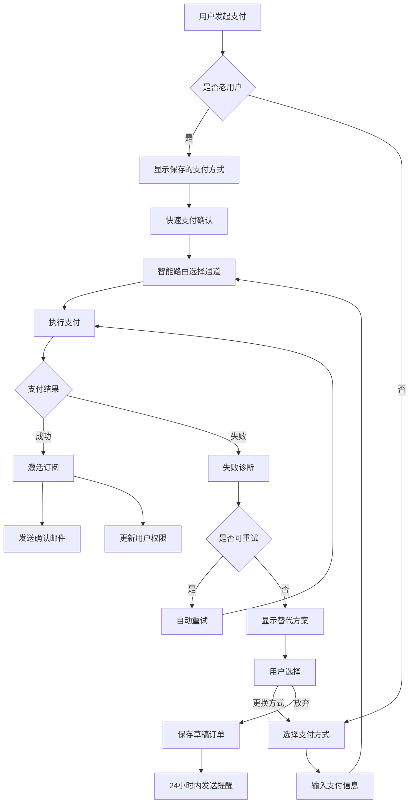
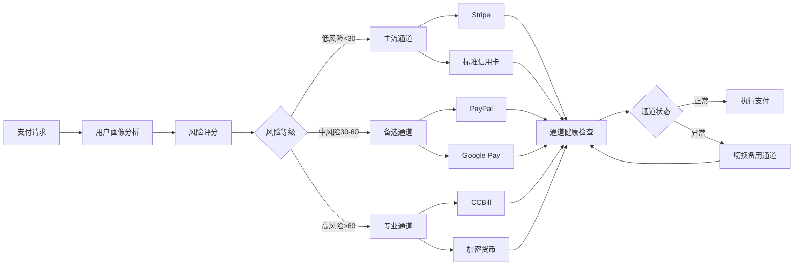
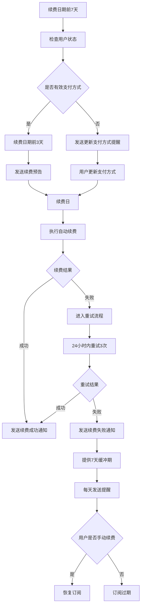
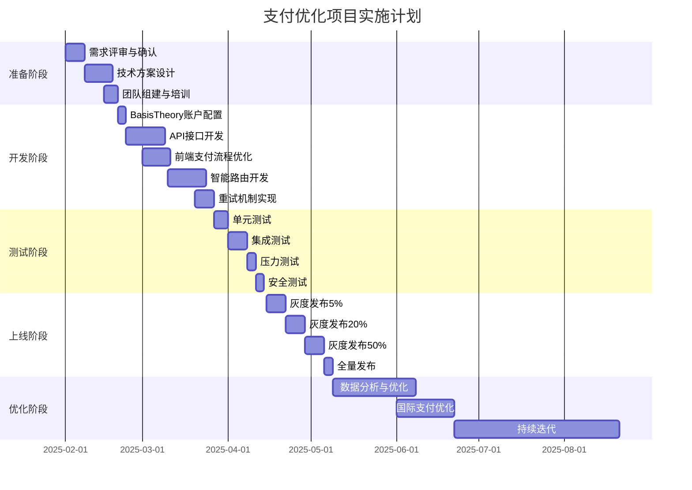

# CrushOn.AI 支付优化产品需求文档（PRD）

**文档版本**: 1.0  
**创建日期**: 2025年1月  
**产品负责人**: 产品团队  
**项目代号**: PaymentBoost  
**文档状态**: 待评审

---

## 一、需求背景与商业目标

### 1.1 业务背景

CrushOn.AI作为AI角色对话平台，目前面临严重的支付转化问题：

**核心问题**：
- 当前支付成功率仅35-45%，意味着**超过一半的付费意愿无法转化为实际收入**
- 每月因支付失败损失的潜在收入预估超过**200万美元**
- 用户因支付失败导致的流失率高达30-40%
- 客服工单中40%与支付问题相关，严重影响运营效率

**行业对比**：
- 行业平均支付成功率：60-70%
- 顶级SaaS产品支付成功率：75-85%
- 我们的差距：25-40个百分点

### 1.2 商业目标

**主要目标**：
1. **提升支付成功率**：从35-45%提升至60%以上（6个月内）
2. **增加收入**：通过支付优化实现月收入增长20-30%
3. **改善用户体验**：支付相关NPS评分从-20提升至+30
4. **降低运营成本**：减少支付相关客服工单50%

**成功指标**：

| 指标名称 | 当前值 | 3个月目标 | 6个月目标 | 衡量方式 |
|---------|--------|-----------|-----------|----------|
| 整体支付成功率 | 40% | 50% | 60% | 成功支付/总支付尝试 |
| 首次支付成功率 | 30% | 40% | 50% | 新用户首次支付成功率 |
| 支付完成时间 | 45秒 | 35秒 | 25秒 | 中位数完成时间 |
| 支付失败后重试率 | 20% | 40% | 60% | 7天内重新尝试支付比例 |
| 月度支付收入 | $X | $X×1.15 | $X×1.30 | 实际收入增长 |

### 1.3 项目价值

**财务价值**：
- 预计年度收入增加：$3,600,000 - $4,800,000
- 客服成本节省：$500,000/年
- 用户生命周期价值提升：25%

**战略价值**：
- 提升市场竞争力
- 改善品牌口碑
- 为国际扩张奠定基础

---

## 二、用户故事与使用场景

### 2.1 核心用户角色

#### 角色1：首次付费用户（New Payer）
- **特征**：第一次尝试付费订阅，对平台信任度有限
- **痛点**：支付失败后不知道如何解决，容易放弃
- **需求**：简单快速的支付流程，清晰的问题解决指引

#### 角色2：续费用户（Renewal User）
- **特征**：已有付费历史，愿意继续使用服务
- **痛点**：续费失败导致服务中断，影响使用体验
- **需求**：自动化续费，失败时及时通知和补救

#### 角色3：高价值用户（Premium User）
- **特征**：订阅豪华版（$49.99/月），重度使用者
- **痛点**：支付问题影响核心体验，容易产生负面情绪
- **需求**：VIP支付通道，专属客服支持

#### 角色4：国际用户（International User）
- **特征**：非美国地区用户，使用本地支付方式
- **痛点**：跨境支付成功率更低，汇率转换问题
- **需求**：本地化支付选项，透明的定价

### 2.2 用户故事

#### 故事1：首次订阅
**作为**一个新用户  
**我想要**快速完成订阅支付  
**以便**立即开始使用高级功能  
**验收标准**：
- 支付流程不超过3步
- 提供至少3种支付方式选择
- 支付失败时提供明确的解决方案

#### 故事2：支付失败处理
**作为**一个支付失败的用户  
**我想要**了解失败原因并获得解决方案  
**以便**成功完成支付  
**验收标准**：
- 显示具体的失败原因（非技术语言）
- 提供至少2种替代支付方案
- 一键联系客服获得帮助

#### 故事3：自动续费
**作为**一个订阅用户  
**我想要**自动续费无感知进行  
**以便**不中断我的服务使用  
**验收标准**：
- 续费前3天发送提醒
- 失败时立即通知并提供7天缓冲期
- 支持更新支付方式而不影响订阅

#### 故事4：灵活支付
**作为**一个预算有限的用户  
**我想要**选择适合我的支付方式  
**以便**在我方便的时候付费  
**验收标准**：
- 支持月付、季付、年付
- 提供充值钱包功能
- 支持礼品卡和优惠码

### 2.3 典型使用场景

#### 场景1：深夜冲动消费
**时间**：晚上11点-凌晨2点  
**情境**：用户在深度使用产品后决定付费  
**特点**：决策快速，对支付流程耐心有限  
**需求**：极简支付流程，一键支付选项

#### 场景2：免费额度用尽
**时间**：使用过程中  
**情境**：免费消息额度耗尽，需要立即充值  
**特点**：使用中断，急需恢复  
**需求**：快速充值通道，即时生效

#### 场景3：朋友推荐注册
**时间**：任意  
**情境**：通过朋友推荐链接注册并付费  
**特点**：有一定信任基础，愿意尝试  
**需求**：新用户优惠，推荐奖励机制

---

## 三、功能需求（用户端体验）

### 3.1 支付方式选择

#### 3.1.1 主流支付方式
**功能描述**：用户可以选择多种支付方式完成订阅

**支付方式优先级**：
1. **P0 - 必须支持**：
   - 信用卡/借记卡（Visa、Mastercard、Amex）
   - PayPal（全球覆盖）
   - 加密货币（USDT、USDC）

2. **P1 - 应该支持**：
   - Apple Pay（iOS用户）
   - Google Pay（Android用户）
   - 礼品卡系统

3. **P2 - 考虑支持**：
   - 电子钱包（Skrill、Neteller）
   - 本地支付（支付宝国际版、微信支付国际版）

**交互设计**：
- 智能排序：基于用户地区和历史偏好排序支付方式
- 一键选择：记住用户上次使用的支付方式
- 可视化提示：用图标和描述说明每种支付方式的特点

#### 3.1.2 支付方式推荐
**功能描述**：基于用户特征智能推荐最适合的支付方式

**推荐逻辑**：
```
如果 用户来自高风险地区：
    推荐 加密货币 > PayPal > 信用卡
如果 用户是回访付费用户：
    推荐 上次成功的支付方式
如果 用户使用移动设备：
    推荐 Apple Pay/Google Pay > PayPal > 信用卡
默认：
    推荐 信用卡 > PayPal > 其他
```

### 3.2 支付流程优化

#### 3.2.1 极简支付流程
**目标**：将支付步骤从5步减少到3步

**当前流程**（5步）：
1. 选择订阅计划
2. 填写个人信息
3. 选择支付方式
4. 输入支付信息
5. 确认支付

**优化后流程**（3步）：
1. 选择订阅计划（包含价格对比）
2. 选择支付方式并输入信息（合并页面）
3. 一键确认支付

**设计要点**：
- 自动填充：利用浏览器自动填充减少输入
- 实时验证：边输入边验证，减少错误
- 进度指示：清晰显示当前步骤

#### 3.2.2 快速充值通道
**功能描述**：为老用户提供一键充值功能

**使用条件**：
- 已有成功支付记录
- 保存了支付方式
- 账户状态正常

**交互流程**：
1. 点击"快速充值"按钮
2. 选择充值金额（预设选项）
3. 确认支付（使用保存的支付方式）

### 3.3 支付失败处理

#### 3.3.1 智能失败诊断
**功能描述**：自动诊断支付失败原因并提供解决方案

**失败类型与处理**：

| 失败类型 | 用户提示 | 解决方案 | 自动处理 |
|---------|---------|---------|---------|
| 余额不足 | "账户余额不足" | 建议充值或使用其他卡片 | 不重试 |
| 银行拒绝 | "您的银行拒绝了此交易" | 提供银行联系指引+替代支付方式 | 3秒后自动重试一次 |
| 风控拦截 | "交易需要额外验证" | 引导完成3D验证或使用PayPal | 切换支付通道重试 |
| 网络超时 | "网络连接超时" | 检查网络并重试 | 自动重试3次 |
| 技术故障 | "系统繁忙" | 稍后重试或联系客服 | 切换备用通道 |

#### 3.3.2 失败后引导
**功能描述**：支付失败后的用户引导和留存策略

**引导流程**：
1. **即时反馈**：
   - 显示失败原因（用户友好语言）
   - 提供情绪安抚（"别担心，这种情况很常见"）

2. **解决方案**：
   - 主要方案：针对性解决建议
   - 备选方案：2-3个替代支付方式
   - 兜底方案：人工客服支持

3. **激励机制**：
   - 限时优惠："现在重试可享受首月8折"
   - 延长试用："支付失败？再免费试用3天"
   - 专属补偿："使用备选支付方式额外赠送100币"

### 3.4 订阅管理

#### 3.4.1 灵活的订阅选项
**功能描述**：提供多样化的订阅方式满足不同需求

**订阅类型**：
1. **周期选择**：
   - 月付（标准）
   - 季付（9折优惠）
   - 年付（7折优惠）
   - 自定义天数（7-365天）

2. **支付时机**：
   - 立即支付
   - 预约支付（指定日期）
   - 分期支付（仅限年付）

3. **组合套餐**：
   - 基础订阅 + 币包
   - 多人共享套餐
   - 学生优惠套餐

#### 3.4.2 订阅状态管理
**功能描述**：清晰展示和管理订阅状态

**状态显示**：
- 当前套餐和到期时间
- 历史订阅记录
- 即将到期提醒（倒计时）
- 账单下载功能

**管理功能**：
- 升级/降级套餐（立即生效或下期生效）
- 暂停订阅（最长3个月）
- 取消订阅（保留数据30天）
- 更换支付方式

### 3.5 支付安全与信任

#### 3.5.1 安全认证展示
**功能描述**：增强用户支付信心

**展示内容**：
- PCI DSS认证标志
- SSL安全锁图标
- 知名支付合作伙伴logo
- 安全保障说明

#### 3.5.2 隐私保护
**功能描述**：保护用户支付隐私

**隐私功能**：
- 账单名称自定义（显示为"Digital Service"而非"CrushOn"）
- 支付记录加密存储
- 一键删除支付方式
- 匿名支付选项（加密货币）

---

## 四、业务流程设计

### 4.1 核心支付流程



### 4.2 智能路由决策流程



### 4.3 续费流程



---

## 五、支付渠道管理策略

### 5.1 渠道选择矩阵

| 用户分层 | 首选渠道 | 备选渠道 | 紧急渠道 | 选择依据 |
|---------|---------|---------|---------|---------|
| 低风险新用户 | Stripe | PayPal | 信用卡直连 | 成功率高，成本低 |
| 低风险老用户 | 上次成功渠道 | Stripe | PayPal | 历史数据优先 |
| 中风险用户 | PayPal | Google Pay | Segpay | 平衡成功率和成本 |
| 高风险用户 | CCBill | Segpay | 加密货币 | 专业高风险处理 |
| 国际用户 | 本地支付 | PayPal | 加密货币 | 本地化优先 |
| VIP用户 | 专属通道 | 任意偏好 | 人工处理 | 成功率最大化 |

### 5.2 动态调整规则

#### 5.2.1 基于成功率调整
```
IF 某渠道1小时成功率 < 30% THEN
    权重降低50%
    触发告警
    
IF 某渠道连续失败 >= 5次 THEN
    临时禁用30分钟
    切换到备用渠道
    
IF 某渠道24小时成功率 > 70% THEN
    权重提升20%
    优先级提升
```

#### 5.2.2 基于成本优化
```
IF 月度支付成本 > 预算120% THEN
    优先使用低成本渠道
    高成本渠道仅用于VIP用户
    
IF 用户LTV > $500 THEN
    不考虑渠道成本
    仅考虑成功率
```

### 5.3 渠道健康监控

**实时监控指标**：
1. **成功率指标**：
   - 5分钟成功率
   - 1小时成功率
   - 24小时成功率

2. **性能指标**：
   - 平均响应时间
   - 超时率
   - 错误率

3. **业务指标**：
   - 平均支付金额
   - 拒付率
   - 投诉率

**告警阈值**：
- 紧急：成功率 < 20% 或 完全不可用
- 严重：成功率 < 40% 或 响应时间 > 10秒
- 警告：成功率 < 50% 或 响应时间 > 5秒

---

## 六、异常场景处理

### 6.1 异常场景清单

| 场景类型 | 具体场景 | 影响范围 | 处理优先级 | 处理策略 |
|---------|---------|---------|-----------|---------|
| **支付异常** | 重复扣款 | 用户资金 | P0 | 自动检测并退款 |
| | 支付超时 | 用户体验 | P0 | 异步查询+补偿 |
| | 部分支付 | 订单完整性 | P1 | 补差价或退款 |
| | 金额错误 | 财务准确性 | P0 | 冻结交易+人工 |
| **系统异常** | 支付网关宕机 | 全体用户 | P0 | 自动切换备用 |
| | 数据库故障 | 数据一致性 | P0 | 事务回滚+重试 |
| | 网络中断 | 部分用户 | P1 | 本地缓存+重试 |
| **用户异常** | 恶意支付 | 平台安全 | P1 | 风控拦截 |
| | 批量退款 | 现金流 | P2 | 人工审核 |
| | 账户盗用 | 用户安全 | P0 | 冻结+验证 |
| **合规异常** | 跨境限制 | 特定地区 | P2 | 提示+替代方案 |
| | 金额限制 | 大额支付 | P2 | 分批支付 |

### 6.2 异常处理流程

#### 6.2.1 重复扣款处理
```
检测机制：
1. 同一用户60秒内相同金额 → 标记可疑
2. 支付指纹匹配 → 确认重复
3. 自动触发退款流程

处理流程：
1. 立即冻结重复交易
2. 发送用户通知（邮件+站内信）
3. 24小时内完成退款
4. 记录事件日志
5. 分析root cause
```

#### 6.2.2 支付超时处理
```
超时定义：
- 前端超时：30秒
- 后端超时：45秒
- 最终超时：60秒

处理策略：
1. 前端超时 → 显示"处理中"状态
2. 后端继续查询支付状态
3. 成功 → 异步通知用户
4. 失败 → 引导重新支付
5. 未知 → 人工介入
```

### 6.3 降级方案

**一级降级**（影响<10%用户）：
- 禁用问题渠道
- 其他渠道正常服务
- 影响用户显示说明

**二级降级**（影响10-30%用户）：
- 仅保留核心支付渠道
- 限制大额支付
- 延迟处理非紧急订阅

**三级降级**（影响>30%用户）：
- 仅保留PayPal和加密货币
- 暂停新用户注册付费
- 免费延长现有用户订阅

**完全降级**（系统故障）：
- 支付功能维护中
- 记录用户意向
- 恢复后批量处理
- 提供补偿方案

---

## 七、数据指标与成功标准

### 7.1 关键业务指标（KPIs）

#### 7.1.1 核心指标

| 指标类别 | 指标名称 | 计算公式 | 当前值 | 目标值 | 监控频率 |
|---------|---------|---------|--------|--------|---------|
| **转化率** | 支付成功率 | 成功支付/总尝试 | 40% | 60% | 实时 |
| | 首付成功率 | 新用户首次成功/首次尝试 | 30% | 50% | 每小时 |
| | 续费成功率 | 续费成功/续费尝试 | 45% | 70% | 每天 |
| | 支付完成率 | 完成支付/开始支付 | 50% | 75% | 实时 |
| **效率** | 平均支付时长 | 总时长/支付次数 | 45秒 | 25秒 | 每小时 |
| | 重试成功率 | 重试成功/总重试 | 20% | 50% | 每天 |
| | 渠道切换成功率 | 切换后成功/切换次数 | 30% | 60% | 每天 |
| **用户体验** | 支付NPS | 推荐者-贬低者 | -20 | +30 | 每月 |
| | 支付投诉率 | 投诉数/支付数 | 15% | 5% | 每周 |
| | 支付放弃率 | 放弃支付/开始支付 | 50% | 25% | 每天 |
| **财务** | 支付手续费率 | 手续费/支付金额 | 8% | 6% | 每月 |
| | 拒付率 | 拒付金额/总支付 | 5% | 2% | 每月 |
| | 人均支付金额 | 总金额/支付用户数 | $15 | $20 | 每周 |

#### 7.1.2 细分指标

**按用户分层**：
- 新用户支付成功率
- 老用户支付成功率
- VIP用户支付成功率
- 不同订阅等级成功率

**按支付方式**：
- 各渠道成功率
- 各渠道平均耗时
- 各渠道成本
- 各渠道用户满意度

**按地区分布**：
- 各国家/地区成功率
- 本地支付使用率
- 跨境支付成功率

### 7.2 数据采集与分析

#### 7.2.1 数据采集点

**前端采集**：
```javascript
// 支付漏斗数据
track('payment_initiated', {
  user_id, plan_id, amount, source
})

track('payment_method_selected', {
  user_id, method, time_spent
})

track('payment_submitted', {
  user_id, method, amount
})

track('payment_result', {
  user_id, success, failure_reason, duration
})
```

**后端采集**：
- 支付请求日志
- 渠道路由决策
- 重试记录
- 异常事件

#### 7.2.2 分析维度

**转化漏斗分析**：
```
访问定价页 → 点击订阅 → 开始支付 → 完成支付 → 支付成功
  100%    →    40%    →    30%   →   20%    →   8%
```

**用户分群分析**：
- 高价值用户行为特征
- 流失用户共性分析
- 成功用户路径分析

**A/B测试框架**：
- 支付流程对比
- 文案优化测试
- 定价策略测试
- 渠道优先级测试

### 7.3 成功标准与里程碑

#### 7.3.1 项目里程碑

**第一阶段（0-1个月）**：基础建设
- [ ] 完成BasisTheory接入
- [ ] 实现基础路由功能
- [ ] 支付成功率达到45%

**第二阶段（1-3个月）**：优化提升
- [ ] 智能路由上线
- [ ] 重试机制完善
- [ ] 支付成功率达到50%

**第三阶段（3-6个月）**：规模化
- [ ] 全量用户覆盖
- [ ] 国际支付优化
- [ ] 支付成功率达到60%

#### 7.3.2 成功标准

**最小成功标准**：
- 支付成功率 ≥ 50%
- 用户投诉率 ≤ 10%
- ROI ≥ 2.0

**目标成功标准**：
- 支付成功率 ≥ 60%
- 用户投诉率 ≤ 5%
- 月收入增长 ≥ 20%
- NPS ≥ +30

**卓越成功标准**：
- 支付成功率 ≥ 70%
- 成为行业标杆
- 月收入增长 ≥ 30%
- NPS ≥ +50

---

## 八、风险评估与缓解措施

### 8.1 风险矩阵

| 风险类别 | 风险描述 | 概率 | 影响 | 风险等级 | 缓解措施 |
|---------|---------|------|------|---------|---------|
| **技术风险** | BasisTheory服务中断 | 低 | 极高 | 高 | 建立直连备份方案，实现自动故障转移 |
| | 支付数据泄露 | 极低 | 极高 | 高 | PCI DSS合规，端到端加密，定期安全审计 |
| | 系统性能瓶颈 | 中 | 高 | 高 | 压力测试，弹性扩容，CDN加速 |
| | 集成复杂度高 | 高 | 中 | 中 | 分阶段实施，充分测试，保留回滚方案 |
| **业务风险** | 支付成功率未达预期 | 中 | 高 | 高 | 持续优化算法，增加备用渠道，人工干预 |
| | 用户体验下降 | 低 | 高 | 中 | A/B测试，用户调研，快速迭代 |
| | 成本超预算 | 中 | 中 | 中 | 动态成本控制，谈判降低费率 |
| | 竞争对手模仿 | 高 | 低 | 低 | 持续创新，建立技术壁垒 |
| **合规风险** | 支付牌照问题 | 低 | 极高 | 高 | 使用持牌第三方，法律咨询 |
| | 跨境支付限制 | 中 | 中 | 中 | 多渠道备份，本地合作伙伴 |
| | 数据隐私法规 | 中 | 高 | 高 | GDPR合规，数据本地化存储 |
| | 反洗钱审查 | 低 | 高 | 中 | KYC流程，交易监控，合规培训 |
| **运营风险** | 客服压力增大 | 高 | 中 | 中 | 自助服务工具，FAQ优化，团队扩充 |
| | 欺诈交易增加 | 中 | 高 | 高 | 机器学习反欺诈，人工审核 |
| | 现金流压力 | 低 | 高 | 中 | 财务预警，信贷额度准备 |

### 8.2 风险缓解策略

#### 8.2.1 技术风险缓解

**高可用架构设计**：
```
主系统（BasisTheory路由）
    ↓ 故障
备份系统（直连支付网关）
    ↓ 故障  
降级系统（仅PayPal+加密货币）
    ↓ 故障
离线系统（记录订单，延迟处理）
```

**数据安全保障**：
1. 不存储敏感支付信息
2. 全程TLS 1.3加密传输
3. 支付令牌化处理
4. 定期渗透测试
5. 实时异常监控

#### 8.2.2 业务风险缓解

**成功率保障机制**：
1. **多渠道策略**：至少3个备用渠道
2. **智能重试**：失败自动切换渠道
3. **人工介入**：VIP用户人工处理
4. **持续优化**：每周分析优化

**用户体验保护**：
1. **灰度发布**：5% → 20% → 50% → 100%
2. **快速回滚**：一键回滚到稳定版本
3. **用户反馈**：实时收集处理
4. **补偿机制**：问题用户给予补偿

#### 8.2.3 合规风险缓解

**合规框架建设**：
1. **牌照合作**：使用持牌机构服务
2. **法律审查**：定期法律合规审查
3. **地区策略**：针对不同地区定制
4. **文档完备**：保持完整合规文档

**反欺诈体系**：
```python
风险评分模型：
- 设备指纹（20%权重）
- IP地址分析（15%权重）
- 用户行为（25%权重）  
- 交易模式（20%权重）
- 历史记录（20%权重）

风险阈值：
- 0-30分：自动通过
- 30-60分：额外验证
- 60-80分：人工审核
- 80-100分：直接拒绝
```

### 8.3 应急预案

#### 8.3.1 支付系统全面故障

**触发条件**：所有支付渠道不可用超过5分钟

**应急流程**：
1. T+0分钟：自动切换到降级模式
2. T+5分钟：发布系统公告
3. T+10分钟：启动离线订单记录
4. T+30分钟：邮件通知受影响用户
5. T+60分钟：评估恢复时间
6. 恢复后：批量处理离线订单

**补偿方案**：
- 所有受影响用户延长3天订阅
- VIP用户额外赠送代币
- 发放限时优惠券

#### 8.3.2 大规模支付欺诈

**触发条件**：欺诈交易超过正常水平5倍

**应急流程**：
1. 立即提高风控阈值
2. 暂停高风险地区支付
3. 人工审核所有大额交易
4. 通知支付合作伙伴
5. 分析攻击模式
6. 更新防御策略

---

## 九、实施计划

### 9.1 项目时间线



### 9.2 团队配置

| 角色 | 人数 | 职责 | 投入度 |
|------|------|------|--------|
| 产品经理 | 1 | 需求管理、协调推进 | 100% |
| 技术负责人 | 1 | 架构设计、技术决策 | 100% |
| 后端开发 | 3 | API开发、路由实现 | 100% |
| 前端开发 | 2 | 支付页面优化 | 100% |
| 测试工程师 | 2 | 测试用例、质量保证 | 100% |
| 数据分析师 | 1 | 数据分析、效果评估 | 50% |
| 运营专员 | 1 | 用户沟通、问题处理 | 50% |
| 客服代表 | 2 | 用户支持、问题反馈 | 30% |

### 9.3 资源需求

**技术资源**：
- BasisTheory企业账户（$2,000/月）
- 支付网关账户（Stripe、PayPal、CCBill等）
- 云服务器扩容（预计增加30%）
- 监控工具升级（Datadog、Sentry）

**预算估算**：
- 开发成本：$150,000（3个月）
- 第三方服务：$30,000（年费）
- 运营成本：$20,000（培训、推广）
- 应急储备：$50,000
- **总预算：$250,000**

### 9.4 依赖关系

**外部依赖**：
1. BasisTheory API稳定性
2. 支付网关合作批准
3. 法务合规审查通过
4. 财务部门预算批准

**内部依赖**：
1. 用户系统改造完成
2. 订单系统升级
3. 数据仓库准备就绪
4. 客服系统集成

---

## 十、附录

### 10.1 竞品支付体验分析

| 平台 | 支付成功率 | 支付方式 | 特色功能 | 可借鉴点 |
|------|-----------|---------|---------|---------|
| Character.AI | 70-80% | 标准信用卡为主 | 简洁流程 | 极简设计 |
| Replika | 65-75% | 多样化 | 订阅灵活 | 套餐设计 |
| OnlyFans | 60-70% | 专业高风险处理 | 钱包系统 | 余额充值 |
| Patreon | 75-85% | 成熟体系 | 创作者分成 | 支付生态 |

### 10.2 用户调研摘要

**调研样本**：500名用户（200名付费用户，300名流失用户）

**关键发现**：
1. 68%的用户因支付失败放弃订阅
2. 45%的用户希望支持加密货币
3. 73%的用户关注支付隐私
4. 82%的用户愿意为更好体验支付溢价

**用户声音**：
> "支付失败3次后我就放弃了，太麻烦了"

> "希望账单上不要显示真实名称"

> "如果能用USDT支付就太好了"

### 10.3 专业术语表

| 术语 | 解释 |
|------|------|
| **支付成功率** | 成功完成的支付占总支付尝试的比例 |
| **MCC代码** | 商户类别代码，用于标识商户类型 |
| **3DS验证** | 3D Secure，信用卡额外安全验证 |
| **PCI DSS** | 支付卡行业数据安全标准 |
| **拒付（Chargeback）** | 用户向银行申请撤销交易 |
| **支付路由** | 根据规则选择最优支付通道 |
| **令牌化（Tokenization）** | 将敏感数据转换为随机令牌 |
| **软拒绝** | 可重试的支付失败 |
| **硬拒绝** | 不可重试的支付失败 |

### 10.4 成功案例参考

**Netflix支付优化案例**：
- 优化前：支付成功率65%
- 优化后：支付成功率85%
- 关键措施：智能重试、本地化支付、失败预测
- 收入提升：23%

**Spotify支付优化案例**：
- 优化前：新用户转化率8%
- 优化后：新用户转化率15%
- 关键措施：免费试用、灵活套餐、家庭共享
- 用户增长：87%

---

## 文档版本历史

| 版本 | 日期 | 作者 | 变更说明 |
|------|------|------|---------|
| 1.0 | 2025-01-30 | 产品团队 | 初始版本发布 |

---

**文档审批**

- 产品负责人：_______________ 日期：_______________
- 技术负责人：_______________ 日期：_______________
- 运营负责人：_______________ 日期：_______________
- 财务负责人：_______________ 日期：_______________

---

*本文档为CrushOn.AI支付优化项目的产品需求文档，具体实施细节可能根据实际情况调整。*