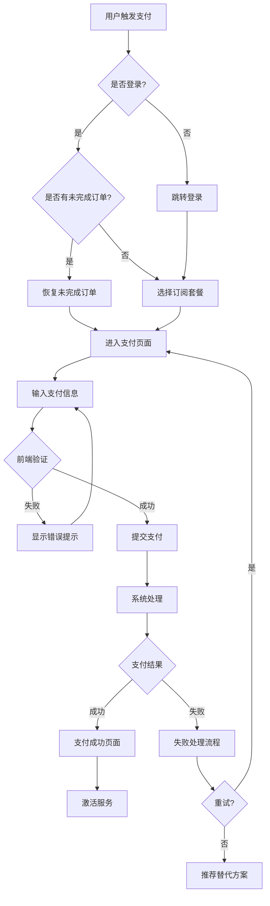

# CrushOn.AI 支付流程详细设计文档

**文档版本**: 1.0  
**更新日期**: 2025年1月  
**文档类型**: 产品流程设计  
**目标**: 详细定义用户支付操作步骤和系统判断逻辑

## 一、支付流程总览

### 1.1 流程概述

支付流程分为四个核心阶段：
1. **触发阶段** - 用户触发支付需求
2. **选择阶段** - 用户选择套餐和支付方式
3. **执行阶段** - 系统处理支付请求
4. **结果阶段** - 展示结果并处理后续

### 1.2 流程图



## 二、详细流程设计

### 2.1 触发阶段

#### 2.1.1 触发场景与用户操作

| 场景 | 触发条件 | 用户操作 | 系统判断 | 下一步 |
|------|---------|---------|---------|--------|
| **免费额度用尽** | 剩余消息=0 | 点击"继续对话" | 检查登录状态 | 弹出支付弹窗 |
| **主动升级** | 访问定价页 | 点击"升级" | 检查当前套餐 | 显示套餐对比 |
| **功能限制** | 使用高级功能 | 点击受限功能 | 验证权限 | 提示升级引导 |
| **到期续费** | 订阅到期 | 点击续费提醒 | 检查历史支付 | 快捷续费流程 |
| **营销活动** | 收到优惠推送 | 点击优惠横幅 | 验证优惠资格 | 显示专属价格 |

#### 2.1.2 系统判断逻辑

```javascript
// 触发支付流程的判断逻辑
function triggerPaymentFlow(context) {
  // Step 1: 检查用户状态
  if (!user.isLoggedIn) {
    return {
      action: "REDIRECT_LOGIN",
      returnUrl: currentPage,
      message: "请先登录以继续"
    };
  }
  
  // Step 2: 检查现有订阅
  if (user.hasActiveSubscription) {
    if (context.trigger === "UPGRADE") {
      return {
        action: "SHOW_UPGRADE_OPTIONS",
        currentPlan: user.currentPlan,
        availableUpgrades: getUpgradeOptions(user.currentPlan)
      };
    }
    return {
      action: "SHOW_CURRENT_PLAN",
      message: "您已有有效订阅"
    };
  }
  
  // Step 3: 检查未完成订单
  const pendingOrder = getPendingOrder(user.id);
  if (pendingOrder && pendingOrder.age < 30 * 60 * 1000) { // 30分钟内
    return {
      action: "RESUME_ORDER",
      orderId: pendingOrder.id,
      message: "继续未完成的订单"
    };
  }
  
  // Step 4: 检查优惠资格
  const eligibleOffers = checkOffers(user);
  
  return {
    action: "START_NEW_PAYMENT",
    offers: eligibleOffers,
    recommendedPlan: getRecommendedPlan(user.usage)
  };
}
```

### 2.2 选择阶段

#### 2.2.1 套餐选择界面

**用户操作流程：**

1. **查看套餐对比**
   - 操作：滑动查看不同套餐
   - 系统：高亮推荐套餐，显示"最受欢迎"标签
   - 判断：基于用户历史使用量推荐合适套餐

2. **选择付费周期**
   - 操作：点击月付/季付/年付标签
   - 系统：实时更新价格，显示节省金额
   - 判断：计算并显示优惠幅度

3. **应用优惠码**（可选）
   - 操作：输入优惠码
   - 系统：实时验证优惠码
   - 判断：检查优惠码有效性和适用条件

**系统判断逻辑：**

```javascript
// 套餐选择的判断逻辑
function handlePlanSelection(selection) {
  const validationResult = {
    isValid: true,
    errors: [],
    warnings: [],
    pricing: {}
  };
  
  // 1. 验证套餐可用性
  if (!isPlanAvailable(selection.planId, user.region)) {
    validationResult.isValid = false;
    validationResult.errors.push("该套餐在您的地区暂不可用");
    return validationResult;
  }
  
  // 2. 检查升降级规则
  if (user.currentPlan) {
    const changeType = getPlanChangeType(user.currentPlan, selection.planId);
    
    switch(changeType) {
      case "DOWNGRADE":
        validationResult.warnings.push("降级将在当前计费周期结束后生效");
        break;
      case "UPGRADE":
        validationResult.pricing.credit = calculateProration(user);
        validationResult.warnings.push(`您将获得 $${validationResult.pricing.credit} 的抵扣`);
        break;
    }
  }
  
  // 3. 计算最终价格
  let finalPrice = getPlanPrice(selection.planId, selection.billingCycle);
  
  // 应用优惠码
  if (selection.promoCode) {
    const promoValidation = validatePromoCode(selection.promoCode, selection);
    if (promoValidation.isValid) {
      finalPrice = applyDiscount(finalPrice, promoValidation.discount);
      validationResult.pricing.discount = promoValidation.discount;
    } else {
      validationResult.errors.push(promoValidation.error);
    }
  }
  
  // 应用地区定价
  finalPrice = applyRegionalPricing(finalPrice, user.region);
  
  validationResult.pricing.final = finalPrice;
  validationResult.pricing.recurring = getRecurringPrice(selection);
  
  return validationResult;
}
```

#### 2.2.2 支付方式选择

**用户操作步骤：**

1. **查看可用支付方式**
   - 系统展示：根据成功率排序的支付选项
   - 智能推荐：标记"推荐"和预计成功率

2. **选择支付方式**
   - 操作：点击支付方式卡片
   - 系统响应：展开对应的输入表单
   - 特殊处理：
     - 已保存的卡片：显示末四位，一键选择
     - PayPal：跳转OAuth登录
     - 加密货币：显示实时汇率

**系统判断逻辑：**

```javascript
// 支付方式推荐算法
function recommendPaymentMethods(context) {
  const methods = [];
  const userProfile = getUserRiskProfile(context.user);
  
  // 1. 获取所有可用支付方式
  const availableMethods = getAvailablePaymentMethods(context.region);
  
  // 2. 计算每种方式的推荐分数
  for (const method of availableMethods) {
    const score = calculateMethodScore({
      baseSuccessRate: method.successRate,
      userRiskScore: userProfile.riskScore,
      amount: context.amount,
      userHistory: getUserPaymentHistory(context.user, method.id),
      regionCompatibility: getRegionCompatibility(method.id, context.region),
      currentLoad: method.currentLoad // 实时负载
    });
    
    methods.push({
      ...method,
      score: score,
      estimatedSuccessRate: calculateEstimatedSuccessRate(score),
      estimatedProcessingTime: getEstimatedTime(method, context)
    });
  }
  
  // 3. 排序和标记
  methods.sort((a, b) => b.score - a.score);
  
  // 标记推荐
  if (methods[0].estimatedSuccessRate > 70) {
    methods[0].tag = "RECOMMENDED";
    methods[0].tagText = "推荐使用";
  }
  
  // 标记快速通道
  const fastMethod = methods.find(m => m.estimatedProcessingTime < 10);
  if (fastMethod) {
    fastMethod.tag = "FAST";
    fastMethod.tagText = "快速支付";
  }
  
  // 标记已保存
  const savedMethods = getSavedPaymentMethods(context.user);
  methods.forEach(method => {
    if (savedMethods.includes(method.id)) {
      method.hasSaved = true;
      method.tagText = "已保存";
    }
  });
  
  return methods;
}
```

### 2.3 执行阶段

#### 2.3.1 支付信息输入

**用户操作与验证：**

| 输入项 | 用户操作 | 前端验证 | 实时反馈 |
|--------|---------|---------|----------|
| **卡号** | 输入16位数字 | Luhn算法验证 | 识别卡类型图标 |
| **有效期** | 选择月/年 | 检查是否过期 | 自动格式化MM/YY |
| **CVV** | 输入3-4位 | 长度验证 | 显示CVV位置提示 |
| **邮编** | 输入邮编 | 格式验证 | 地址自动补全 |
| **持卡人姓名** | 输入姓名 | 字符验证 | 大写转换 |

**前端验证逻辑：**

```javascript
// 支付信息实时验证
const paymentValidation = {
  // 卡号验证
  validateCardNumber: (input) => {
    const cleaned = input.replace(/\s/g, '');
    
    // 1. 长度检查
    if (cleaned.length < 13 || cleaned.length > 19) {
      return { valid: false, error: "卡号长度无效" };
    }
    
    // 2. Luhn算法验证
    if (!luhnCheck(cleaned)) {
      return { valid: false, error: "卡号无效" };
    }
    
    // 3. 识别卡类型
    const cardType = detectCardType(cleaned);
    
    // 4. 检查是否支持该卡类型
    if (!supportedCardTypes.includes(cardType)) {
      return { 
        valid: false, 
        error: `暂不支持${cardType}卡`,
        suggestion: "请使用Visa或MasterCard"
      };
    }
    
    return { 
      valid: true, 
      cardType: cardType,
      maskedNumber: maskCardNumber(cleaned)
    };
  },
  
  // 实时格式化
  formatters: {
    cardNumber: (input) => {
      // 格式化为 4-4-4-4
      return input.replace(/(\d{4})(?=\d)/g, '$1 ');
    },
    expiryDate: (input) => {
      // 格式化为 MM/YY
      if (input.length === 2 && !input.includes('/')) {
        return input + '/';
      }
      return input;
    }
  },
  
  // 综合验证
  validateForm: (formData) => {
    const errors = [];
    
    // 必填项检查
    const requiredFields = ['cardNumber', 'expiryDate', 'cvv', 'cardholderName'];
    requiredFields.forEach(field => {
      if (!formData[field]) {
        errors.push({
          field: field,
          message: `${fieldLabels[field]}不能为空`
        });
      }
    });
    
    // 过期日期检查
    if (formData.expiryDate) {
      const [month, year] = formData.expiryDate.split('/');
      const expiry = new Date(2000 + parseInt(year), parseInt(month) - 1);
      if (expiry < new Date()) {
        errors.push({
          field: 'expiryDate',
          message: '卡片已过期'
        });
      }
    }
    
    return {
      isValid: errors.length === 0,
      errors: errors
    };
  }
};
```

#### 2.3.2 支付提交与处理

**提交流程：**

```javascript
// 支付提交的完整流程
async function submitPayment(paymentData) {
  const processFlow = {
    steps: [],
    currentStep: 0,
    result: null
  };
  
  try {
    // Step 1: 创建支付会话
    processFlow.steps.push({
      name: "INIT_SESSION",
      status: "processing",
      message: "正在初始化支付..."
    });
    
    const session = await createPaymentSession({
      userId: user.id,
      planId: paymentData.planId,
      amount: paymentData.amount,
      metadata: {
        ip: getUserIP(),
        deviceId: getDeviceFingerprint(),
        sessionId: getCurrentSession()
      }
    });
    
    processFlow.steps[0].status = "completed";
    
    // Step 2: 令牌化敏感数据
    processFlow.steps.push({
      name: "TOKENIZE",
      status: "processing",
      message: "正在加密支付信息..."
    });
    
    const token = await BasisTheory.tokenize({
      cardNumber: paymentData.cardNumber,
      expiryDate: paymentData.expiryDate,
      cvv: paymentData.cvv
    });
    
    processFlow.steps[1].status = "completed";
    
    // Step 3: 风险评估
    processFlow.steps.push({
      name: "RISK_ASSESSMENT",
      status: "processing",
      message: "正在验证交易安全性..."
    });
    
    const riskScore = await assessRisk({
      sessionId: session.id,
      amount: paymentData.amount,
      userProfile: getUserProfile(),
      behaviorSignals: collectBehaviorSignals()
    });
    
    processFlow.steps[2].status = "completed";
    
    // Step 4: 选择支付网关
    processFlow.steps.push({
      name: "ROUTE_SELECTION",
      status: "processing",
      message: "正在选择最佳支付通道..."
    });
    
    const gateway = selectOptimalGateway({
      riskScore: riskScore,
      amount: paymentData.amount,
      region: user.region,
      preferredGateway: paymentData.preferredGateway
    });
    
    processFlow.steps[3].status = "completed";
    
    // Step 5: 执行支付
    processFlow.steps.push({
      name: "PROCESS_PAYMENT",
      status: "processing",
      message: `正在通过${gateway.name}处理支付...`
    });
    
    const paymentResult = await executePayment({
      gateway: gateway.id,
      token: token,
      amount: paymentData.amount,
      currency: paymentData.currency,
      description: getPaymentDescription(paymentData),
      metadata: session.metadata
    });
    
    processFlow.steps[4].status = paymentResult.success ? "completed" : "failed";
    processFlow.result = paymentResult;
    
    return processFlow;
    
  } catch (error) {
    // 错误处理
    const failedStep = processFlow.steps.find(s => s.status === "processing");
    if (failedStep) {
      failedStep.status = "failed";
      failedStep.error = error.message;
    }
    
    processFlow.result = {
      success: false,
      error: error,
      recoverable: isRecoverableError(error)
    };
    
    return processFlow;
  }
}
```

### 2.4 结果阶段

#### 2.4.1 成功处理流程

**用户看到的界面流程：**

1. **成功动画展示** (0-2秒)
   - 显示：✓ 支付成功动画
   - 文案："支付成功！正在激活您的订阅..."

2. **订阅激活确认** (2-3秒)
   - 显示：套餐详情、有效期、下次续费时间
   - 操作：可下载收据、查看订阅详情

3. **引导返回使用** (3秒后)
   - 自动跳转：返回原对话/功能页面
   - 提示：显示新解锁的功能

**系统处理逻辑：**

```javascript
// 支付成功后的处理流程
async function handlePaymentSuccess(paymentResult) {
  const successFlow = {
    tasks: [],
    notifications: []
  };
  
  // 1. 更新订阅状态
  successFlow.tasks.push(
    await updateSubscription({
      userId: paymentResult.userId,
      planId: paymentResult.planId,
      status: 'ACTIVE',
      startDate: new Date(),
      endDate: calculateEndDate(paymentResult.planId, paymentResult.billingCycle),
      paymentId: paymentResult.paymentId,
      gatewaySubscriptionId: paymentResult.subscriptionId
    })
  );
  
  // 2. 解锁功能权限
  successFlow.tasks.push(
    await unlockFeatures({
      userId: paymentResult.userId,
      features: getPlanFeatures(paymentResult.planId),
      immediate: true
    })
  );
  
  // 3. 发送确认邮件
  successFlow.notifications.push(
    await sendEmail({
      to: user.email,
      template: 'payment_success',
      data: {
        planName: getPlanName(paymentResult.planId),
        amount: paymentResult.amount,
        receiptUrl: generateReceiptUrl(paymentResult.paymentId),
        manageUrl: generateManageUrl(user.id)
      }
    })
  );
  
  // 4. 记录分析事件
  trackEvent('payment_success', {
    userId: paymentResult.userId,
    planId: paymentResult.planId,
    amount: paymentResult.amount,
    gateway: paymentResult.gateway,
    timeToComplete: paymentResult.processingTime
  });
  
  // 5. 触发庆祝动画
  return {
    success: true,
    subscription: successFlow.tasks[0],
    redirectUrl: paymentResult.returnUrl || '/dashboard',
    celebrationType: getCelebrationType(paymentResult.amount)
  };
}
```

#### 2.4.2 失败处理流程

**失败类型与用户引导：**

| 失败类型 | 用户看到的提示 | 可选操作 | 系统自动处理 |
|---------|--------------|---------|-------------|
| **余额不足** | "卡内余额不足，请检查账户" | 1.更换支付方式<br>2.联系银行 | 记录失败原因 |
| **银行拒绝** | "您的银行拒绝了此交易" | 1.联系银行解除限制<br>2.使用PayPal | 推荐替代方案 |
| **风控拦截** | "交易被标记为风险交易" | 1.验证身份<br>2.尝试小额支付 | 触发人工审核 |
| **网络超时** | "支付处理超时" | 1.重试<br>2.稍后再试 | 自动查询状态 |
| **3D验证失败** | "银行验证失败" | 1.重新验证<br>2.检查短信验证码 | 等待用户操作 |

**智能失败处理逻辑：**

```javascript
// 支付失败的智能处理
async function handlePaymentFailure(failureResult) {
  const failureFlow = {
    type: categorizeFailure(failureResult.errorCode),
    retryable: false,
    alternatives: [],
    userGuidance: {},
    autoActions: []
  };
  
  // 1. 分析失败原因
  switch (failureFlow.type) {
    case 'INSUFFICIENT_FUNDS':
      failureFlow.userGuidance = {
        title: "余额不足",
        message: "您的卡内余额不足以完成此次支付",
        icon: "warning",
        suggestions: [
          { text: "检查账户余额", action: "EXTERNAL_LINK", url: "https://bank.com" },
          { text: "使用其他卡片", action: "CHANGE_CARD" },
          { text: "选择更便宜的套餐", action: "DOWNGRADE_PLAN" }
        ]
      };
      break;
      
    case 'RISK_DECLINED':
      failureFlow.retryable = true;
      failureFlow.userGuidance = {
        title: "支付被拒绝",
        message: "为了您的账户安全，此次交易需要额外验证",
        icon: "shield",
        suggestions: [
          { text: "联系银行授权", action: "SHOW_BANK_GUIDE" },
          { text: "使用PayPal（成功率更高）", action: "SWITCH_TO_PAYPAL" },
          { text: "尝试较小金额", action: "SPLIT_PAYMENT" }
        ]
      };
      
      // 自动尝试备用方案
      failureFlow.autoActions.push({
        action: "RETRY_WITH_DIFFERENT_MCC",
        delay: 3000,
        params: { mccCode: "5734" } // 软件商户类别码
      });
      break;
      
    case 'NETWORK_ERROR':
      failureFlow.retryable = true;
      failureFlow.userGuidance = {
        title: "网络连接问题",
        message: "支付处理时遇到网络问题",
        icon: "wifi-off",
        suggestions: [
          { text: "立即重试", action: "RETRY_IMMEDIATELY" },
          { text: "检查支付状态", action: "CHECK_STATUS" }
        ]
      };
      
      // 自动查询支付状态
      failureFlow.autoActions.push({
        action: "QUERY_PAYMENT_STATUS",
        delay: 5000,
        maxAttempts: 3
      });
      break;
      
    case 'CARD_EXPIRED':
      failureFlow.userGuidance = {
        title: "卡片已过期",
        message: "您的信用卡已过期，请更新卡片信息",
        icon: "calendar",
        suggestions: [
          { text: "更新卡片信息", action: "UPDATE_CARD" },
          { text: "使用新卡", action: "ADD_NEW_CARD" }
        ]
      };
      break;
  }
  
  // 2. 推荐替代支付方式
  if (failureFlow.type !== 'USER_CANCELLED') {
    const alternatives = await getAlternativePaymentMethods({
      failureType: failureFlow.type,
      originalGateway: failureResult.gateway,
      amount: failureResult.amount,
      userRegion: user.region
    });
    
    failureFlow.alternatives = alternatives.map(alt => ({
      method: alt.name,
      successRate: alt.estimatedSuccessRate,
      reason: alt.recommendReason,
      action: `SWITCH_TO_${alt.id.toUpperCase()}`
    }));
  }
  
  // 3. 保存失败记录用于优化
  await saveFailureAnalytics({
    userId: user.id,
    failureType: failureFlow.type,
    errorCode: failureResult.errorCode,
    gateway: failureResult.gateway,
    amount: failureResult.amount,
    timestamp: new Date(),
    recovered: false // 后续更新
  });
  
  // 4. 提供激励措施
  if (shouldOfferIncentive(user, failureResult)) {
    failureFlow.incentive = {
      type: "DISCOUNT",
      amount: 15,
      message: "获得15%优惠，再试一次",
      expiresIn: 3600 // 1小时
    };
  }
  
  return failureFlow;
}
```

### 2.5 重试机制详细设计

#### 2.5.1 自动重试决策树

```javascript
// 重试决策逻辑
function determineRetryStrategy(failure, attemptCount) {
  const strategy = {
    shouldRetry: false,
    method: null,
    delay: 0,
    modifications: {}
  };
  
  // 不可重试的情况
  const nonRetryableCodes = [
    'INVALID_CARD_NUMBER',
    'STOLEN_CARD', 
    'USER_CANCELLED',
    'DUPLICATE_TRANSACTION'
  ];
  
  if (nonRetryableCodes.includes(failure.code)) {
    return strategy;
  }
  
  // 根据失败类型确定重试策略
  const retryMatrix = {
    'RISK_DECLINED': {
      attempts: [
        { method: 'CHANGE_MCC', delay: 0 },
        { method: 'SWITCH_GATEWAY', delay: 3000 },
        { method: 'REDUCE_AMOUNT', delay: 5000 }
      ]
    },
    'GATEWAY_TIMEOUT': {
      attempts: [
        { method: 'SAME_GATEWAY', delay: 1000 },
        { method: 'BACKUP_GATEWAY', delay: 2000 },
        { method: 'FALLBACK_GATEWAY', delay: 4000 }
      ]
    },
    'PROCESSING_ERROR': {
      attempts: [
        { method: 'SAME_GATEWAY', delay: 2000 },
        { method: 'ALTERNATIVE_ROUTE', delay: 5000 }
      ]
    },
    'VELOCITY_LIMIT': {
      attempts: [
        { method: 'WAIT_AND_RETRY', delay: 60000 },
        { method: 'SPLIT_TRANSACTION', delay: 0 }
      ]
    }
  };
  
  const strategyOptions = retryMatrix[failure.type];
  
  if (strategyOptions && attemptCount < strategyOptions.attempts.length) {
    const attempt = strategyOptions.attempts[attemptCount];
    
    strategy.shouldRetry = true;
    strategy.method = attempt.method;
    strategy.delay = attempt.delay;
    
    // 设置重试修改参数
    switch (attempt.method) {
      case 'CHANGE_MCC':
        strategy.modifications.mcc = getAlternativeMCC();
        break;
      case 'REDUCE_AMOUNT':
        strategy.modifications.amount = Math.floor(failure.amount / 2);
        strategy.modifications.description = 'Partial payment 1/2';
        break;
      case 'SWITCH_GATEWAY':
        strategy.modifications.gateway = selectBackupGateway(failure.gateway);
        break;
      case 'SPLIT_TRANSACTION':
        strategy.modifications = {
          split: true,
          parts: 2,
          firstAmount: 9.99
        };
        break;
    }
  }
  
  return strategy;
}
```

#### 2.5.2 用户体验优化

**重试过程中的UI状态管理：**

```javascript
// UI状态管理
const retryUIManager = {
  states: {
    INITIAL_PROCESSING: {
      icon: 'spinner',
      title: '正在处理支付...',
      message: '请稍候，这可能需要几秒钟',
      showProgress: true,
      progressValue: 33
    },
    
    RETRYING_FIRST: {
      icon: 'refresh',
      title: '正在尝试备用通道...',
      message: '首次尝试遇到问题，正在使用备用方案',
      showProgress: true,
      progressValue: 66,
      showCancel: true
    },
    
    RETRYING_FINAL: {
      icon: 'alert-circle',
      title: '最后一次尝试...',
      message: '如果仍然失败，我们将提供其他支付选项',
      showProgress: true,
      progressValue: 90,
      showAlternatives: true
    },
    
    SUCCESS_AFTER_RETRY: {
      icon: 'check-circle',
      title: '支付成功！',
      message: '感谢您的耐心等待',
      showProgress: false,
      celebrate: true
    },
    
    FAILED_AFTER_RETRIES: {
      icon: 'x-circle',
      title: '支付未能完成',
      message: '请尝试其他支付方式或联系客服',
      showProgress: false,
      showAlternatives: true,
      showSupport: true
    }
  },
  
  // 状态转换
  transition: function(fromState, toState, context) {
    const transition = {
      animation: 'fade',
      duration: 300,
      callback: null
    };
    
    // 特殊转换效果
    if (fromState === 'RETRYING_FINAL' && toState === 'SUCCESS_AFTER_RETRY') {
      transition.animation = 'success-burst';
      transition.duration = 500;
      transition.callback = () => showConfetti();
    }
    
    return transition;
  }
};
```

## 三、特殊场景处理

### 3.1 并发支付防护

```javascript
// 防止重复支付
async function preventDuplicatePayment(userId, planId, amount) {
  const lockKey = `payment_lock_${userId}_${planId}`;
  const lockDuration = 60000; // 60秒锁
  
  // 尝试获取锁
  const acquired = await acquireLock(lockKey, lockDuration);
  
  if (!acquired) {
    // 检查是否有进行中的支付
    const pendingPayment = await checkPendingPayment(userId, planId);
    
    if (pendingPayment) {
      return {
        blocked: true,
        reason: 'PAYMENT_IN_PROGRESS',
        existingPaymentId: pendingPayment.id,
        message: '您有一笔支付正在处理中，请稍候'
      };
    }
  }
  
  // 检查最近的成功支付
  const recentPayment = await getRecentSuccessfulPayment(userId, planId, 300000); // 5分钟内
  
  if (recentPayment) {
    await releaseLock(lockKey);
    return {
      blocked: true,
      reason: 'RECENT_SUCCESS',
      existingPaymentId: recentPayment.id,
      message: '您刚刚完成了一笔相同的支付'
    };
  }
  
  return {
    blocked: false,
    lockKey: lockKey
  };
}
```

### 3.2 支付状态查询

```javascript
// 异步查询支付状态
async function queryPaymentStatus(paymentId, options = {}) {
  const maxAttempts = options.maxAttempts || 5;
  const interval = options.interval || 5000;
  
  for (let attempt = 1; attempt <= maxAttempts; attempt++) {
    try {
      // 查询内部记录
      const internalStatus = await getPaymentStatus(paymentId);
      
      // 如果是终态，直接返回
      if (['SUCCESS', 'FAILED', 'REFUNDED'].includes(internalStatus.status)) {
        return internalStatus;
      }
      
      // 查询支付网关
      const gatewayStatus = await queryGatewayStatus(
        internalStatus.gateway,
        internalStatus.gatewayTransactionId
      );
      
      // 同步状态
      if (gatewayStatus.status !== internalStatus.status) {
        await updatePaymentStatus(paymentId, gatewayStatus);
        
        // 如果变为成功，激活订阅
        if (gatewayStatus.status === 'SUCCESS') {
          await activateSubscriptionAsync(paymentId);
        }
        
        return gatewayStatus;
      }
      
      // 等待下次查询
      if (attempt < maxAttempts) {
        await sleep(interval * Math.pow(1.5, attempt - 1)); // 指数退避
      }
      
    } catch (error) {
      console.error(`查询支付状态失败: ${error.message}`);
      
      if (attempt === maxAttempts) {
        // 标记为需要人工处理
        await markForManualReview(paymentId, error);
      }
    }
  }
  
  return {
    status: 'UNKNOWN',
    requiresManualReview: true
  };
}
```

## 四、监控指标

### 4.1 关键流程指标

| 指标名称 | 计算方式 | 目标值 | 告警阈值 |
|---------|---------|--------|---------|
| **整体转化率** | 成功支付/支付页访问 | >40% | <30% |
| **表单完成率** | 提交支付/开始填写 | >70% | <50% |
| **首次成功率** | 首次成功/总尝试 | >45% | <35% |
| **重试成功率** | 重试成功/重试次数 | >40% | <25% |
| **平均完成时间** | 总时长/成功笔数 | <30s | >60s |
| **放弃率** | 放弃支付/开始支付 | <20% | >35% |

### 4.2 漏斗分析

```javascript
// 支付漏斗追踪
const paymentFunnel = {
  stages: [
    { name: 'VIEW_PRICING', label: '查看价格页' },
    { name: 'SELECT_PLAN', label: '选择套餐' },
    { name: 'START_PAYMENT', label: '开始支付' },
    { name: 'ENTER_INFO', label: '填写信息' },
    { name: 'SUBMIT_PAYMENT', label: '提交支付' },
    { name: 'PAYMENT_SUCCESS', label: '支付成功' }
  ],
  
  track: function(userId, stage, metadata = {}) {
    analytics.track({
      userId: userId,
      event: `payment_funnel_${stage}`,
      properties: {
        stage: stage,
        timestamp: Date.now(),
        ...metadata
      }
    });
  },
  
  analyze: function(timeRange) {
    const analysis = {
      funnel: [],
      dropoffs: [],
      conversionRate: 0
    };
    
    this.stages.forEach((stage, index) => {
      const count = getStageCount(stage.name, timeRange);
      const rate = index > 0 ? count / analysis.funnel[0].count : 1;
      
      analysis.funnel.push({
        stage: stage.name,
        label: stage.label,
        count: count,
        rate: rate
      });
      
      if (index > 0) {
        const dropoff = analysis.funnel[index - 1].count - count;
        const dropoffRate = dropoff / analysis.funnel[index - 1].count;
        
        analysis.dropoffs.push({
          from: this.stages[index - 1].label,
          to: stage.label,
          count: dropoff,
          rate: dropoffRate
        });
      }
    });
    
    analysis.conversionRate = 
      analysis.funnel[analysis.funnel.length - 1].count / 
      analysis.funnel[0].count;
    
    return analysis;
  }
};
```

## 五、总结

本文档详细定义了CrushOn.AI的支付流程，包括：

1. **四大阶段**：触发→选择→执行→结果，每个阶段都有明确的用户操作和系统判断
2. **智能决策**：基于用户画像、风险评分、实时数据的动态路由选择
3. **失败处理**：多层次的重试机制和用户引导，最大化支付成功率
4. **用户体验**：简化的3步支付流程，实时反馈，智能推荐
5. **监控体系**：完整的漏斗分析和关键指标监控

通过这套优化后的支付流程，预期将支付成功率从35-45%提升至60%以上，显著改善用户体验和业务收入。