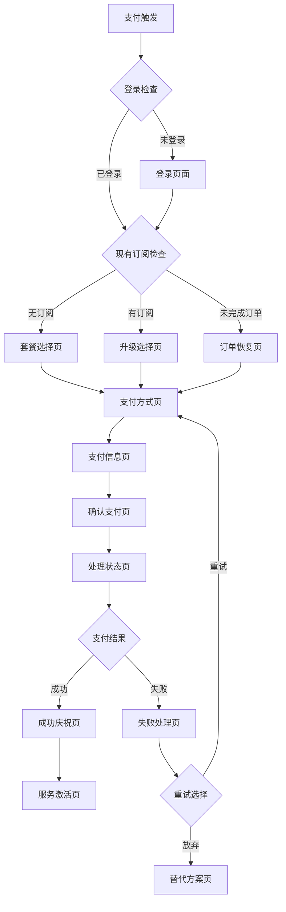

# CrushOn.AI 支付系统交互设计文档

**文档版本**: 1.0  
**创建日期**: 2025年1月  
**文档类型**: 交互设计文档  
**设计负责人**: UX团队  
**关联文档**: CrushOn支付系统产品需求文档

## 一、交互设计总览

### 1.1 设计理念

**核心理念：信任驱动的流畅支付**

- **信任优先**：通过视觉元素和交互反馈建立用户信任
- **流畅体验**：减少用户决策负担，引导顺畅完成支付
- **智能适配**：根据用户行为和上下文智能适配界面
- **错误包容**：预期并优雅处理各种异常情况

### 1.2 交互原则

| 原则 | 描述 | 应用场景 |
|-----|------|----------|
| **渐进式引导** | 将复杂流程分解为简单步骤 | 支付流程分为3个主要步骤 |
| **即时反馈** | 每个用户操作都有即时响应 | 表单验证、加载状态、错误提示 |
| **预期管理** | 明确告知用户下一步将发生什么 | 进度指示、时间预估 |
| **错误恢复** | 提供清晰的错误修复路径 | 失败重试、替代方案 |
| **情感化设计** | 在关键节点提供积极情感反馈 | 成功动画、鼓励文案 |

## 二、用户流程设计

### 2.1 主要用户路径



### 2.2 关键页面交互流程

#### 2.2.1 套餐选择页交互

**页面目标**：帮助用户快速选择合适的套餐

**交互流程**：
1. **页面进入**
   - 动画：套餐卡片从左到右依次滑入(300ms延迟)
   - 智能推荐：推荐套餐高亮显示"推荐"标签
   - 价格对比：显示年付优惠幅度

2. **套餐对比**
   ```
   用户操作：悬停在套餐卡片上
   系统反应：
   - 卡片轻微放大(scale: 1.02)
   - 阴影加深(shadow: 0 8px 25px rgba(0,0,0,0.15))
   - 显示更多功能详情
   - 其他卡片轻微变暗(opacity: 0.8)
   ```

3. **周期选择**
   ```
   用户操作：点击月付/年付切换
   系统反应：
   - 价格数字滑动切换动画(duration: 400ms)
   - 年付显示节省金额高亮
   - 更新"立即购买"按钮价格
   ```

4. **优惠码应用**
   ```
   用户操作：点击"有优惠码？"
   系统反应：
   - 输入框从下方滑出(slideDown: 300ms)
   - 聚焦到输入框
   - 占位符：请输入优惠码
   
   用户操作：输入优惠码
   系统反应：
   - 实时验证(防抖500ms)
   - 有效：显示绿色对勾+折扣金额
   - 无效：显示红色错误信息
   ```

5. **选择确认**
   ```
   用户操作：点击"立即购买"
   系统反应：
   - 按钮loading状态(spinner + 文案"处理中...")
   - 保存选择到sessionStorage
   - 跳转到支付方式页(页面切换动画)
   ```

#### 2.2.2 支付方式选择页交互

**页面目标**：引导用户选择最优支付方式

**交互流程**：
1. **支付方式展示**
   ```
   布局：垂直卡片列表
   排序：根据推荐算法排序
   标识：
   - "推荐" (绿色标签)
   - "快速" (蓝色标签)  
   - "已保存" (灰色标签)
   - 预估成功率显示
   ```

2. **支付方式选择**
   ```
   用户操作：点击支付方式卡片
   系统反应：
   - 卡片选中状态(border: 2px solid #007bff)
   - 其他卡片变为未选中状态
   - 对应的表单区域展开(slideDown: 400ms)
   - 聚焦到第一个输入框
   ```

3. **智能表单显示**
   ```
   信用卡：显示卡号、有效期、CVV、持卡人姓名
   PayPal：显示"将跳转到PayPal页面"说明
   加密货币：显示汇率、钱包地址生成
   ```

#### 2.2.3 支付信息填写页交互

**页面目标**：简化信息填写，减少错误

**交互流程**：
1. **表单渐进显示**
   ```
   字段显示顺序：
   1. 卡号输入框(自动聚焦)
   2. 有效期+CVV(卡号验证通过后显示)
   3. 持卡人姓名(CVV填写后显示)
   4. 账单地址(可选，自动隐藏)
   ```

2. **实时验证反馈**
   ```
   卡号输入：
   - 自动格式化(4-4-4-4)
   - Luhn算法验证
   - 卡片类型图标显示
   - 不支持卡类型警告
   
   有效期输入：
   - 自动格式化(MM/YY)
   - 过期检查
   - 错误提示:"卡片已过期"
   
   CVV输入：
   - 长度限制(3-4位)
   - 位置提示(悬停显示CVV位置)
   ```

3. **输入体验优化**
   ```
   自动跳转：卡号输入完成自动跳到有效期
   智能检测：检测粘贴完整卡号，自动分割填入
   保存选项：询问是否保存支付方式(可选)
   ```

#### 2.2.4 支付确认页交互

**页面目标**：最后确认，建立信任

**交互流程**：
1. **订单信息确认**
   ```
   显示内容：
   - 套餐名称和周期
   - 原价、折扣、最终价格
   - 支付方式(卡号末四位)
   - 服务生效时间
   ```

2. **安全保障展示**
   ```
   信任标识：
   - SSL加密图标
   - 支付安全认证
   - 退款政策链接
   - 隐私政策链接
   ```

3. **支付按钮设计**
   ```
   按钮样式：
   - 大尺寸(height: 56px)
   - 鲜明颜色(background: #007bff)
   - 文案："安全支付 ¥XX.XX"
   - 微动画：悬停微光效果
   ```

#### 2.2.5 支付处理页交互

**页面目标**：缓解等待焦虑，展示处理进度

**交互流程**：
1. **处理状态展示**
   ```
   进度指示器：
   - 环形进度条(0-100%)
   - 处理步骤列表
   - 当前步骤高亮
   - 预估剩余时间
   ```

2. **动态状态更新**
   ```
   状态流转：
   1. "正在验证支付信息..." (0-20%)
   2. "正在处理支付请求..." (20-60%)
   3. "正在激活您的订阅..." (60-90%)
   4. "即将完成..." (90-100%)
   ```

3. **异常处理**
   ```
   超时处理：
   - 30秒后显示"处理时间较长"提示
   - 提供"查看状态"按钮
   - 60秒后自动切换到状态查询
   ```

#### 2.2.6 支付结果页交互

**成功页面交互**：
1. **庆祝动画**
   ```
   动画序列：
   1. 成功图标放大出现(scale: 0->1.2->1)
   2. 彩带飘落效果(confetti)
   3. "支付成功"文字淡入
   4. 服务详情卡片向上滑入
   ```

2. **服务激活确认**
   ```
   显示内容：
   - 订阅套餐名称
   - 服务有效期
   - 解锁功能列表
   - "立即体验"按钮
   ```

**失败页面交互**：
1. **失败原因说明**
   ```
   信息展示：
   - 错误图标(温和的橙色，不是红色)
   - 用户友好的错误描述
   - 可能的原因分析
   - 解决建议
   ```

2. **重试机制**
   ```
   重试选项：
   - "重新尝试"按钮(主要操作)
   - "更换支付方式"按钮
   - "联系客服"链接
   ```

3. **替代方案推荐**
   ```
   智能推荐：
   - 基于失败原因推荐替代方式
   - 显示替代方式的成功率
   - 一键切换到推荐方式
   ```

## 三、微交互设计

### 3.1 状态反馈

| 状态 | 视觉反馈 | 交互反馈 | 时长 |
|-----|---------|---------|------|
| **加载中** | Spinner + 骨架屏 | 禁用交互元素 | <2秒 |
| **成功** | 绿色对勾 + 微弹跳 | 短震动(移动端) | 1秒 |
| **错误** | 橙色警告 + 抖动 | 输入框红边 | 持续到修正 |
| **处理中** | 进度条 + 脉冲效果 | 显示进度百分比 | 实际时长 |

### 3.2 页面转场动画

```css
/* 页面切换动画 */
.page-transition-enter {
  opacity: 0;
  transform: translateX(30px);
}

.page-transition-enter-active {
  opacity: 1;
  transform: translateX(0);
  transition: all 300ms ease-out;
}

/* 表单展开动画 */
.form-expand-enter {
  max-height: 0;
  opacity: 0;
}

.form-expand-enter-active {
  max-height: 500px;
  opacity: 1;
  transition: all 400ms ease-out;
}
```

### 3.3 按钮交互状态

```css
/* 主要按钮设计 */
.primary-button {
  background: linear-gradient(135deg, #667eea 0%, #764ba2 100%);
  border: none;
  border-radius: 8px;
  color: white;
  font-weight: 600;
  padding: 16px 32px;
  transition: all 200ms ease;
  
  &:hover {
    transform: translateY(-2px);
    box-shadow: 0 8px 25px rgba(102, 126, 234, 0.3);
  }
  
  &:active {
    transform: translateY(0);
  }
  
  &:disabled {
    opacity: 0.6;
    cursor: not-allowed;
    transform: none;
  }
}

/* 加载状态按钮 */
.button-loading {
  position: relative;
  
  &::after {
    content: '';
    position: absolute;
    width: 20px;
    height: 20px;
    border: 2px solid transparent;
    border-top: 2px solid white;
    border-radius: 50%;
    animation: spin 1s linear infinite;
  }
}
```

## 四、响应式交互设计

### 4.1 移动端适配

**触摸优化**：
- 按钮最小点击区域44x44px
- 输入框高度不小于44px
- 间距考虑手指操作习惯

**手势支持**：
- 支持滑动切换套餐
- 下拉刷新支付状态
- 长按复制订单信息

**键盘适配**：
- 输入时自动滚动到可视区域
- 数字键盘自动调起
- 软键盘遮挡处理

### 4.2 断点设计

| 断点 | 屏幕宽度 | 布局调整 | 交互变化 |
|-----|---------|---------|----------|
| **移动端** | <768px | 单列布局 | 全屏弹窗、底部操作栏 |
| **平板** | 768-1024px | 两列布局 | 侧边栏、悬浮确认框 |
| **桌面端** | >1024px | 三列布局 | 模态框、悬停效果 |

## 五、无障碍设计

### 5.1 键盘导航

- Tab键顺序逻辑清晰
- 焦点状态明显可见
- 支持Enter/Space激活
- Esc键关闭弹窗

### 5.2 屏幕阅读器支持

```html
<!-- 语义化标签 -->
<form role="form" aria-label="支付信息表单">
  <fieldset>
    <legend>信用卡信息</legend>
    <label for="cardNumber">
      卡号
      <input 
        id="cardNumber"
        type="text"
        aria-describedby="cardNumberHelp"
        aria-required="true"
      />
    </label>
    <div id="cardNumberHelp" class="sr-only">
      请输入16位信用卡号码
    </div>
  </fieldset>
</form>

<!-- 动态状态通知 -->
<div aria-live="polite" aria-atomic="true">
  <span id="status-message"></span>
</div>
```

### 5.3 颜色和对比度

- 文字对比度符合WCAG AA标准(4.5:1)
- 错误信息不仅依赖颜色表达
- 支持高对比度模式
- 色盲友好的配色方案

## 六、错误处理和边界情况

### 6.1 网络异常处理

**离线状态**：
```javascript
// 离线检测和处理
window.addEventListener('offline', () => {
  showNotification('网络连接已断开，请检查网络后重试', 'warning');
  disablePaymentForm();
});

window.addEventListener('online', () => {
  showNotification('网络连接已恢复', 'success');
  enablePaymentForm();
});
```

**请求超时**：
```javascript
// 超时重试机制
const paymentRequest = async (data, retries = 3) => {
  try {
    const response = await fetch('/api/payment', {
      method: 'POST',
      body: JSON.stringify(data),
      timeout: 30000
    });
    return response;
  } catch (error) {
    if (retries > 0 && error.name === 'AbortError') {
      showRetryDialog('请求超时，是否重试？');
      return paymentRequest(data, retries - 1);
    }
    throw error;
  }
};
```

### 6.2 表单验证错误

**实时验证**：
```javascript
// 防抖验证
const debouncedValidate = debounce((field, value) => {
  const validation = validateField(field, value);
  updateFieldStatus(field, validation);
}, 500);

// 字段状态管理
const updateFieldStatus = (field, validation) => {
  const element = document.getElementById(field);
  const errorElement = document.getElementById(`${field}-error`);
  
  if (validation.isValid) {
    element.classList.remove('error');
    element.classList.add('success');
    errorElement.textContent = '';
  } else {
    element.classList.remove('success');
    element.classList.add('error');
    errorElement.textContent = validation.message;
  }
};
```

### 6.3 支付失败处理

**智能失败分析**：
```javascript
const handlePaymentFailure = (error) => {
  const failureAnalysis = analyzeFailure(error);
  
  switch (failureAnalysis.category) {
    case 'CARD_DECLINED':
      showFailureModal({
        title: '银行拒绝了此交易',
        message: '请联系您的银行或尝试其他支付方式',
        actions: [
          { text: '联系银行', action: 'showBankContact' },
          { text: '更换支付方式', action: 'changePaymentMethod' }
        ]
      });
      break;
      
    case 'NETWORK_ERROR':
      showFailureModal({
        title: '网络连接问题',
        message: '支付过程中遇到网络问题，请重试',
        actions: [
          { text: '立即重试', action: 'retryPayment' },
          { text: '查看订单状态', action: 'checkOrderStatus' }
        ]
      });
      break;
      
    default:
      showGenericFailureModal(failureAnalysis);
  }
};
```

## 七、性能优化

### 7.1 加载优化

**关键渲染路径优化**：
```javascript
// 分步加载支付组件
const loadPaymentComponents = async () => {
  // 1. 优先加载核心组件
  const coreComponents = await import('./components/PaymentCore');
  
  // 2. 懒加载辅助组件
  setTimeout(() => {
    import('./components/PaymentEnhancements');
  }, 1000);
  
  // 3. 预加载下一步组件
  const link = document.createElement('link');
  link.rel = 'prefetch';
  link.href = '/api/payment-methods';
  document.head.appendChild(link);
};
```

**图片和资源优化**：
```html
<!-- 关键图标内联SVG -->
<svg class="payment-icon" width="24" height="24">
  <use href="#visa-icon"></use>
</svg>

<!-- 非关键图片懒加载 -->

```

### 7.2 交互性能

**动画性能优化**：
```css
/* 使用transform和opacity进行动画，避免重排重绘 */
.card-hover {
  transform: translateY(0);
  transition: transform 200ms ease-out;
  will-change: transform;
}

.card-hover:hover {
  transform: translateY(-4px);
}

/* 使用GPU加速 */
.payment-modal {
  transform: translateZ(0);
  backface-visibility: hidden;
}
```

**事件处理优化**：
```javascript
// 事件委托减少内存占用
document.addEventListener('click', (e) => {
  if (e.target.matches('.payment-method-card')) {
    handlePaymentMethodSelect(e.target);
  }
});

// 防抖处理高频事件
const handleScroll = throttle(() => {
  updatePaymentProgress();
}, 100);
```

---

**文档状态**: ✅ 已完成  
**下一步**: 开始界面样式规范设计