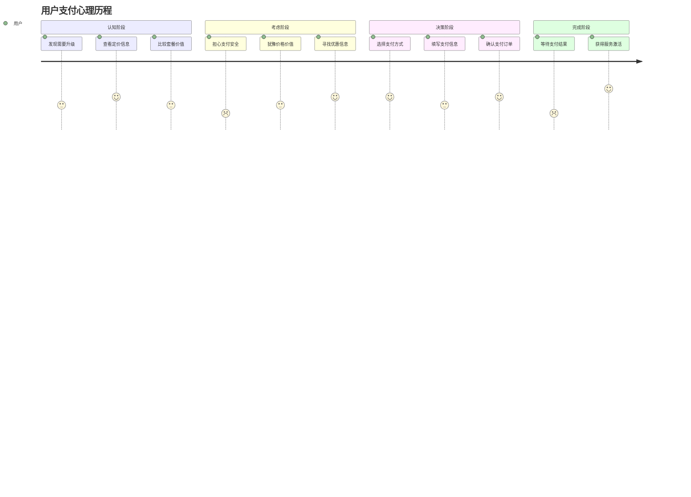
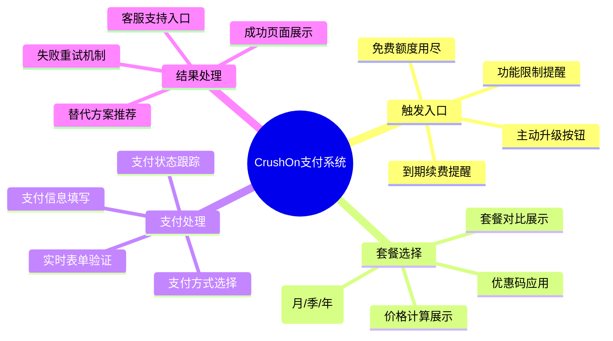
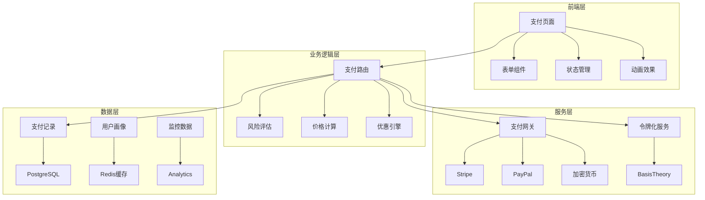
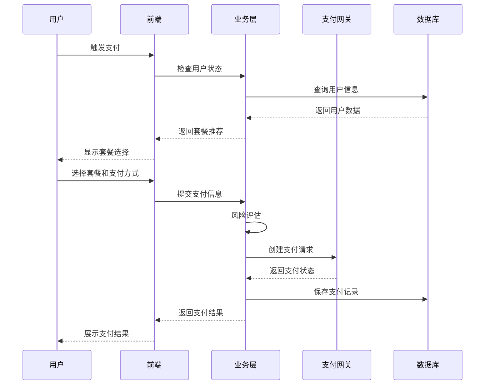

# CrushOn.AI 支付系统产品需求文档 (PRD)

**文档版本**: 1.0  
**创建日期**: 2025年1月  
**文档类型**: 产品需求文档  
**产品负责人**: 产品团队  
**优先级**: P0 (最高优先级)

## 一、产品概述

### 1.1 产品目标

通过优化支付流程设计，将CrushOn.AI的支付成功率从当前的35-45%提升至60%以上，同时提升用户支付体验，减少支付放弃率，最终提升平台收入转化。

### 1.2 核心价值主张

- **简化支付**：3步完成支付，减少用户操作负担
- **智能推荐**：基于AI算法推荐最优支付方案
- **多重保障**：智能重试+失败处理，最大化成功率
- **透明体验**：实时反馈支付状态，增强用户信心

### 1.3 成功指标

| 指标类别 | 当前表现 | 目标值 | 衡量方式 |
|---------|---------|--------|----------|
| **转化指标** | 35-45% | 60%+ | 支付成功订单/支付页访问 |
| **体验指标** | 未知 | <30秒 | 平均支付完成时间 |
| **留存指标** | 未知 | >80% | 支付后7日留存率 |
| **满意度** | 未知 | >4.5分 | 支付流程NPS评分 |

## 二、用户需求分析

### 2.1 目标用户画像

#### 主要用户群体
1. **免费用户升级** (50%)
   - 特征：已体验产品价值，额度用尽需升级
   - 痛点：价格敏感，支付犹豫
   - 需求：优惠政策，支付保障

2. **新用户直接付费** (30%)
   - 特征：初次接触，对产品感兴趣
   - 痛点：信任度不足，担心效果
   - 需求：试用保障，退费政策

3. **老用户续费** (20%)
   - 特征：已是付费用户，到期续费
   - 痛点：忘记续费，自动续费担忧
   - 需求：续费提醒，灵活管理

### 2.2 用户支付行为分析

### 2.3 核心用户需求

| 需求类别 | 具体需求 | 重要性 | 现状满足度 | 优化优先级 |
|---------|---------|--------|-----------|----------|
| **信任需求** | 支付安全保障 | 高 | 中 | P0 |
| **效率需求** | 快速完成支付 | 高 | 低 | P0 |
| **选择需求** | 多种支付方式 | 中 | 中 | P1 |
| **透明需求** | 实时状态反馈 | 中 | 低 | P1 |
| **保障需求** | 失败处理机制 | 高 | 低 | P0 |

## 三、功能需求

### 3.1 核心功能架构

### 3.2 详细功能需求

#### 3.2.1 支付触发模块

**功能描述**：用户在不同场景下触发支付需求时的统一入口处理

| 功能点 | 需求描述 | 验收标准 |
|-------|---------|---------|
| **智能触发判断** | 根据用户状态自动判断支付入口类型 | 登录状态检查准确率100% |
| **上下文保持** | 支付完成后自动返回原页面 | 返回路径准确率>95% |
| **优惠活动展示** | 根据用户画像展示个性化优惠 | 优惠匹配准确率>80% |
| **订单恢复** | 30分钟内未完成订单可恢复 | 订单恢复成功率>90% |

#### 3.2.2 套餐选择模块

**功能描述**：用户选择合适套餐和付费周期的交互界面

| 功能点 | 需求描述 | 验收标准 |
|-------|---------|---------|
| **套餐对比** | 以卡片形式展示不同套餐对比 | 3个套餐并排展示，突出推荐 |
| **动态定价** | 根据选择实时更新价格和优惠 | 价格更新延迟<100ms |
| **优惠码验证** | 支持优惠码输入和实时验证 | 优惠码验证响应<2秒 |
| **智能推荐** | 基于使用历史推荐最适合套餐 | 推荐点击率>40% |

#### 3.2.3 支付信息模块

**功能描述**：支付方式选择和支付信息填写的表单界面

| 功能点 | 需求描述 | 验收标准 |
|-------|---------|---------|
| **支付方式智能排序** | 根据成功率和用户画像排序 | 首位推荐成功率>70% |
| **实时表单验证** | 支付信息输入时实时验证反馈 | 验证反馈延迟<200ms |
| **安全输入保护** | CVV等敏感信息安全处理 | 通过PCI DSS认证 |
| **自动填充优化** | 支持浏览器密码管理器 | 自动填充识别率>80% |

#### 3.2.4 支付处理模块

**功能描述**：支付提交后的处理流程和状态展示

| 功能点 | 需求描述 | 验收标准 |
|-------|---------|---------|
| **智能路由选择** | 根据风险评分选择最优网关 | 首次成功率提升10% |
| **实时状态跟踪** | 支付处理过程的实时状态展示 | 状态更新延迟<1秒 |
| **自动重试机制** | 失败后智能选择重试策略 | 重试成功率>40% |
| **进度指示器** | 清晰的处理进度和时间预估 | 时间预估准确率>70% |

#### 3.2.5 结果处理模块

**功能描述**：支付成功/失败后的结果展示和后续处理

| 功能点 | 需求描述 | 验收标准 |
|-------|---------|---------|
| **成功庆祝动画** | 支付成功后的积极反馈动画 | 动画播放成功率>95% |
| **服务即时激活** | 支付成功后立即激活对应服务 | 激活延迟<3秒 |
| **失败原因说明** | 清晰解释失败原因和解决方案 | 用户理解度>80% |
| **替代方案推荐** | 失败后推荐其他支付方式 | 替代方案转化率>30% |

### 3.3 非功能性需求

| 需求类别 | 具体要求 | 衡量标准 |
|---------|---------|---------|
| **性能需求** | 页面加载时间<2秒，支付处理<30秒 | Web Vitals评分>90 |
| **安全需求** | PCI DSS合规，数据加密传输 | 安全审计100%通过 |
| **可用性** | 99.9%可用性，支持降级处理 | 月度可用性统计 |
| **兼容性** | 支持主流浏览器和移动设备 | 兼容性测试覆盖率>95% |
| **可扩展性** | 支持10倍流量增长 | 压力测试通过 |

## 四、产品架构

### 4.1 系统架构图

### 4.2 数据流设计

## 五、设计原则

### 5.1 用户体验原则

1. **简约至上**：每个页面最多3个主要操作，减少用户认知负担
2. **即时反馈**：每个用户操作都要有即时的视觉反馈
3. **容错设计**：预期用户可能的错误操作，提供友好的错误处理
4. **渐进增强**：核心功能优先，高级功能作为增强体验

### 5.2 技术实现原则

1. **前端优先**：优先在前端完成验证和反馈，减少后端请求
2. **弹性设计**：支付网关故障时自动降级到备用方案
3. **数据驱动**：基于真实数据进行决策和优化
4. **监控优先**：每个关键节点都要有监控和告警

## 六、开发计划

### 6.1 里程碑规划

| 阶段 | 时间周期 | 主要交付 | 成功标准 |
|-----|---------|---------|----------|
| **MVP版本** | Week 1-2 | 基础支付流程 | 支付成功率>45% |
| **优化版本** | Week 3-4 | 智能推荐+重试机制 | 支付成功率>55% |
| **完整版本** | Week 5-6 | 完整UI/UX+监控 | 支付成功率>60% |
| **迭代优化** | Week 7-8 | A/B测试+数据优化 | 转化率持续提升 |

### 6.2 风险评估

| 风险类型 | 风险描述 | 影响程度 | 应对措施 |
|---------|---------|---------|----------|
| **技术风险** | 支付网关API变更 | 中 | 多网关备份，版本兼容处理 |
| **合规风险** | PCI DSS认证延期 | 高 | 提前申请，使用第三方令牌化 |
| **业务风险** | 用户接受度低 | 中 | A/B测试，灰度发布 |
| **性能风险** | 高并发支付处理 | 中 | 负载测试，缓存优化 |

## 七、成功评估

### 7.1 关键指标(KPI)

**主要指标**
- 支付成功率：目标60%+
- 支付转化率：支付页访问到成功支付
- 平均支付时间：目标<30秒
- 支付放弃率：目标<20%

**辅助指标**
- 首次成功率：目标45%+
- 重试成功率：目标40%+
- 用户满意度：目标4.5+/5.0
- 客服支付相关咨询下降：目标-30%

### 7.2 A/B测试计划

| 测试项目 | 对比方案 | 测试指标 | 预期结果 |
|---------|---------|---------|----------|
| **支付页布局** | 单页vs多步骤 | 转化率 | 多步骤+5% |
| **支付方式排序** | 智能推荐vs固定顺序 | 首次成功率 | 智能推荐+8% |
| **价格展示方式** | 突出优惠vs原价展示 | 选择转化率 | 突出优惠+15% |
| **失败页面设计** | 重试引导vs替代方案 | 二次尝试率 | 重试引导+10% |

### 7.3 持续优化策略

1. **数据驱动决策**：每周分析支付数据，识别优化点
2. **用户反馈收集**：支付后问卷调研，收集用户建议
3. **竞品分析对比**：定期分析竞品支付流程优化点
4. **技术性能优化**：持续优化页面加载速度和响应性能

---

**文档状态**: ✅ 已完成  
**下一步**: 开始交互设计和UI设计阶段