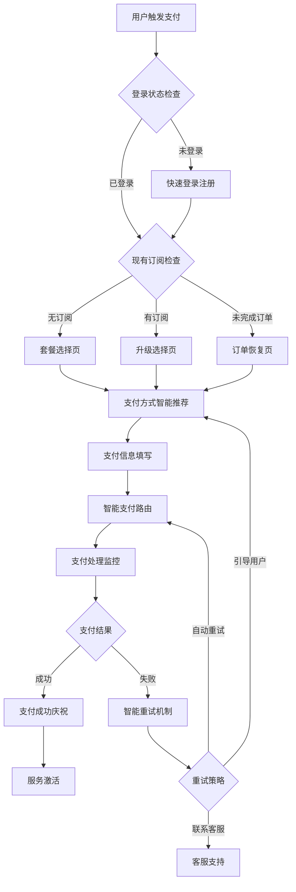
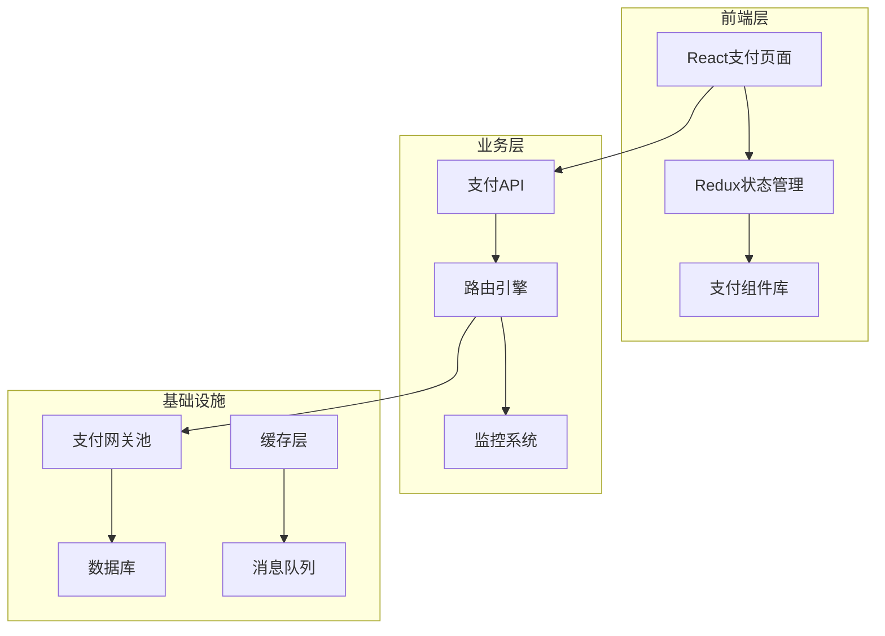
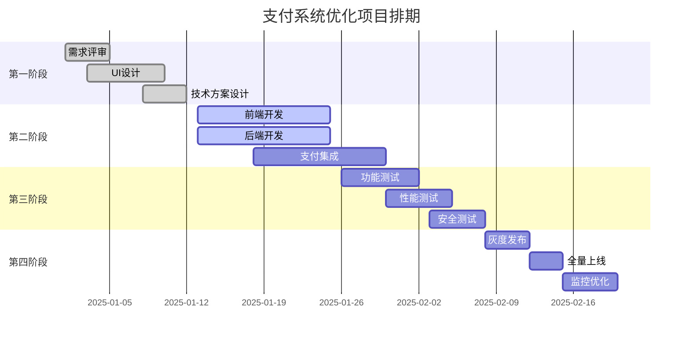

# CrushOn.AI 支付系统优化产品需求文档

## 1. 前言及目标

一些重要框架文档、需求背景

📌 **背景**
• 当前支付成功率仅为35-45%，远低于行业标准60%+
• 支付流程复杂导致用户在支付环节大量流失，转化率偏低
• 缺乏智能化的支付路由和失败处理机制
• 支付体验不够流畅，影响用户满意度和收入增长

**目标**
• 提升支付成功率至60%+，优化支付转化漏斗
• 简化支付流程，平均支付时长控制在30秒内
• 增加智能支付路由和自动重试机制
• 建立完整的支付监控和数据分析体系

**文档变更记录**

| 时间 | 变更人 | 主要变更内容 |
|------|--------|-------------|
| 2025.1.3 | @产品团队 | 创建文档 |

---

## 2. 大纲、总原型图、名词定义

### 脑图大纲/流程图



### 总原型图

Figma原型链接: https://www.figma.com/design/CrushOnPaymentOptimization

### 名词定义

| 术语/缩略词 | 说明 |
|------------|------|
| **支付成功率** | 成功完成支付的订单数占总支付尝试数的比例 |
| **支付转化率** | 从访问支付页到完成支付的用户转化比例 |
| **智能路由** | 基于用户特征和实时数据选择最优支付网关 |
| **PCI DSS** | 支付卡行业数据安全标准，确保支付信息安全处理 |
| **BasisTheory** | 第三方令牌化服务，用于安全处理敏感支付信息 |

---

## 3. 功能详解

**XX**: 表示是按钮  **XX**: 表示是专有名词

**【XXXX】**: 表示是界面或弹窗  **[X]**: 表示是可配置的数字

<span style="color: red">重点强调：红色字</span>  <span style="background: yellow">需要讨论的部分：标黄字</span>  

<span style="background: lime">确认后修改的文字：绿色标黄：同步大家后可改为默认字黑色。</span>

<span style="color: orange">可配文本：橙色的字</span>  <span style="color: blue">公式：蓝色字</span>

### 3.1 智能支付入口

#### 3.1.1 套餐选择页优化

1. **智能套餐推荐系统**
   a. 基于用户画像推荐最适合套餐
      i. 分析用户历史使用量和行为模式
      ii. 显示推荐理由【**Recommended for you**】
   b. 套餐价值展示优化
      i. 突出核心功能差异
      ii. 显示相比基础版的增值功能
      iii. 添加用户评价和使用数据展示
   c. 价格展示策略
      i. 月付/年付切换，突出年付优惠
      ii. 显示节省金额 <span style="color: blue">节省金额 = 月付价格 × 12 - 年付价格</span>
      iii. 限时优惠标签显示

2. **支付信任度建设**
   a. 安全认证标识展示
      i. SSL加密图标
      ii. PCI DSS合规认证
      iii. 退款保障说明
   b. 支付方式预览
      i. 显示可用支付方式图标
      ii. 预估支付成功率【**95% success rate**】

#### 3.1.2 支付方式智能推荐

1. **智能排序算法**
   a. 根据用户特征推荐最优支付方式
      i. 地理位置适配
      ii. 历史支付成功率
      iii. 用户设备和浏览器特征
   b. 推荐标签显示
      i. 【**Recommended**】标签
      ii. 【**Fastest**】快速支付标签
      iii. 预估处理时间显示

2. **支付方式展示优化**
   a. 卡片式布局，清晰展示各支付方式
      i. 支付方式图标
      ii. 支付方式名称
      iii. 预估成功率和处理时间
   b. 已保存支付方式优先展示
      i. 显示卡号后四位
      ii. 一键支付选项
      iii. 【**Use saved card**】按钮

### 3.2 支付流程优化

#### 3.2.1 三步式支付流程

1. **Step 1: 套餐确认**
   a. 显示选中套餐详情
      i. 套餐名称和周期
      ii. 功能清单概览
      iii. 价格明细（含税费说明）
   b. 最后机会优化
      i. 显示其他用户的选择数据
      ii. 提供升级建议（如适用）

2. **Step 2: 支付方式**
   a. 智能推荐最优支付方式
   b. 支持快速切换其他方式
   c. 实时显示支付处理时间预估

3. **Step 3: 支付确认**
   a. 最终价格确认
   b. 服务条款同意
   c. 【**Complete Purchase**】确认支付按钮

#### 3.2.2 支付表单优化

1. **渐进式表单设计**
   a. 分步骤显示表单字段，减少认知负担
      i. 第一步：卡号输入（自动聚焦）
      ii. 第二步：有效期和CVV（卡号验证通过后显示）
      iii. 第三步：账单地址（如需要）
   
2. **实时验证和智能提示**
   a. 卡号实时验证
      i. Luhn算法验证
      ii. 卡片类型自动识别
      iii. 不支持卡片类型友好提示
   b. 智能错误修复建议
      i. 常见错误模式识别
      ii. 一键修复建议
      iii. 输入格式自动纠正

3. **支付安全展示**
   a. 实时安全状态指示器
   b. 数据加密处理说明
   c. 【**Your payment is secured**】安全提示

### 3.3 智能支付处理

#### 3.3.1 支付路由系统

1. **实时网关选择算法**
   ```javascript
   // 智能网关选择逻辑
   function selectOptimalGateway(userProfile, paymentData) {
     const factors = {
       gatewaySuccess: getGatewaySuccessRates(),
       userRisk: assessUserRisk(userProfile),
       amount: paymentData.amount,
       region: userProfile.region,
       cardType: paymentData.cardType
     };
     
     return calculateOptimalRoute(factors);
   }
   ```

2. **多网关备份机制**
   a. 主网关失败自动切换备用网关
   b. <span style="color: red">最多支持3次自动重试</span>
   c. 每次重试间隔递增（1s, 3s, 5s）

#### 3.3.2 支付状态监控

1. **实时进度展示**
   a. 环形进度条显示处理进度
   b. 分阶段状态说明
      i. "正在验证支付信息..." (0-20%)
      ii. "正在联系银行处理..." (20-70%)  
      iii. "正在确认支付结果..." (70-90%)
      iv. "正在激活您的服务..." (90-100%)

2. **异常情况处理**
   a. 超时处理机制
      i. 30秒后显示"处理时间较长"提示
      ii. 60秒后提供"查看状态"选项
   b. 网络异常处理
      i. 自动重连机制
      ii. 离线状态检测和提示

### 3.4 支付结果处理

#### 3.4.1 支付成功体验

1. **庆祝动画序列**
   a. 成功图标弹性放大动画（0-0.5秒）
   b. "Payment Successful!"文字滑入（0.5-1秒）
   c. 订阅详情卡片展示（1-1.5秒）
   d. "Start Using Now"按钮出现（1.5-2秒）

2. **服务激活确认**
   a. 实时激活用户订阅权限
   b. 显示激活的具体功能
      i. 解锁的模型列表
      ii. 增加的消息额度
      iii. 新的功能权限
   c. 使用指导
      i. 【**Explore New Features**】按钮
      ii. 功能亮点快速导览

#### 3.4.2 支付失败智能处理

1. **失败原因智能分析**
   ```javascript
   // 失败原因分类和处理
   const failureHandler = {
     'CARD_DECLINED': {
       userMessage: '您的银行拒绝了此次交易',
       suggestions: ['联系银行确认', '尝试其他支付方式'],
       autoAction: 'SWITCH_GATEWAY'
     },
     'INSUFFICIENT_FUNDS': {
       userMessage: '卡内余额不足',
       suggestions: ['选择更小金额套餐', '使用其他卡片'],
       autoAction: 'SUGGEST_LOWER_PLAN'
     },
     'NETWORK_TIMEOUT': {
       userMessage: '网络连接超时',
       suggestions: ['检查网络后重试'],
       autoAction: 'AUTO_RETRY'
     }
   };
   ```

2. **智能重试策略**
   a. 根据失败类型选择重试方案
      i. 网关切换重试
      ii. 金额调整重试
      iii. 支付方式推荐
   b. 用户友好的重试界面
      i. 清晰的失败原因说明
      ii. 【**Try Again**】重试按钮
      iii. 【**Try Different Method**】切换方式按钮

### 3.5 支付数据分析

#### 3.5.1 实时监控指标

1. **核心转化漏斗**
   ```
   访问定价页 (100%) 
   ↓ 
   选择套餐 (75%) 
   ↓ 
   进入支付 (60%) 
   ↓ 
   填写信息 (50%) 
   ↓ 
   提交支付 (45%) 
   ↓ 
   支付成功 (40%)
   ```

2. **关键监控指标**
   - **支付成功率**: 目标 60%+
   - **首次成功率**: 目标 45%+  
   - **平均支付时长**: 目标 <30秒
   - **重试成功率**: 目标 40%+

#### 3.5.2 A/B测试框架

1. **测试实验配置**
   - 支付按钮文案测试："立即支付" vs "安全支付"
   - 价格展示策略：划线价 vs 直接优惠价
   - 支付方式排序：智能推荐 vs 固定排序
   - 信任标识：显示认证 vs 隐藏认证

2. **实验结果评估**
   ```javascript
   // A/B测试效果评估
   const experimentResults = {
     conversionRateImprovement: '+12%',
     statisticalSignificance: 'p < 0.05',
     recommendedAction: 'ROLLOUT_TO_ALL_USERS'
   };
   ```

---

## 4. 技术实现要求

### 4.1 系统架构



### 4.2 核心技术栈

- **前端**: React 18 + TypeScript + Tailwind CSS
- **状态管理**: Redux Toolkit + RTK Query  
- **后端**: Node.js + Express + TypeScript
- **数据库**: PostgreSQL + Redis
- **支付集成**: Stripe + PayPal + BasisTheory
- **监控**: DataDog + Sentry

### 4.3 安全合规要求

1. **PCI DSS合规**
   - 使用BasisTheory进行支付数据令牌化
   - 全程HTTPS加密传输
   - 敏感数据不存储在自有系统

2. **数据安全**
   - 支付数据端到端加密
   - 访问日志完整记录
   - 定期安全审计

---

## 5. 项目排期与里程碑

### 5.1 开发计划



### 5.2 关键里程碑

| 里程碑 | 时间节点 | 交付内容 | 成功标准 |
|--------|---------|---------|----------|
| **MVP版本** | 2025-02-01 | 基础支付流程优化 | 支付成功率>50% |
| **完整版本** | 2025-02-15 | 智能路由+监控系统 | 支付成功率>60% |
| **优化版本** | 2025-03-01 | 数据驱动优化 | 用户满意度>4.5 |

---

## 6. 数据需求

### 6.1 埋点需求

• **支付流程关键节点**
  - 访问定价页 PV/UV
  - 选择套餐 PV/UV，按套餐类型分组
  - 进入支付页 PV/UV
  - 支付方式选择 PV/UV，按支付方式分组
  - 支付提交 PV/UV
  - 支付成功/失败 PV/UV，按失败原因分组

• **用户行为数据**
  - 页面停留时长
  - 支付完成总时长
  - 重试次数和成功率
  - 放弃支付节点分析

### 6.2 监控告警

• **实时监控指标**
  - 支付成功率 < 55% 立即告警
  - 平均响应时间 > 5秒 警告
  - 单一网关成功率 < 40% 切换网关
  - 系统错误率 > 3% 告警

• **业务监控看板**
  - 实时GMV和订单量
  - 各支付方式成功率对比
  - 支付流程漏斗转化率
  - 用户支付时长分布

---

## 7. 风险评估与应对

### 7.1 技术风险

| 风险项 | 影响程度 | 应对措施 |
|--------|---------|----------|
| **支付网关故障** | 高 | 多网关备份+自动切换 |
| **PCI合规问题** | 高 | 使用第三方令牌化服务 |
| **性能瓶颈** | 中 | 压力测试+性能优化 |
| **数据安全** | 高 | 端到端加密+安全审计 |

### 7.2 业务风险  

| 风险项 | 影响程度 | 应对措施 |
|--------|---------|----------|
| **用户接受度** | 中 | A/B测试+灰度发布 |
| **竞争对手跟进** | 低 | 持续创新+技术壁垒 |
| **法规变化** | 中 | 合规团队跟进+及时调整 |

---

## 8. 成功评估

### 8.1 核心目标

| 指标类别 | 当前值 | 目标值 | 评估周期 |
|---------|--------|--------|----------|
| **支付成功率** | 40% | 60%+ | 每日 |
| **支付转化率** | 18% | 35%+ | 每周 |
| **平均支付时长** | 45秒 | <30秒 | 每日 |
| **用户满意度** | 3.8/5 | 4.5+/5 | 每月 |

### 8.2 业务收益

- **预期收入增长**: +50-80%
- **客服工单减少**: -60%  
- **用户留存提升**: +15%
- **市场竞争优势**: 支付体验行业领先

---

**文档状态**: ✅ 已完成  
**审核状态**: 待产品评审  
**下次更新**: 根据评审意见调整